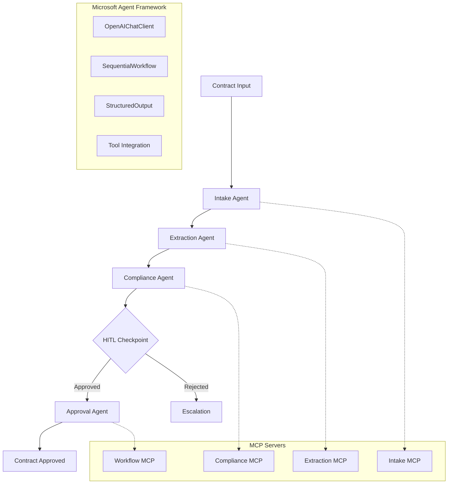

# Microsoft Agent Framework - Contract Processing Agents

## Overview

Fully declarative contract processing agents built with **Microsoft Agent Framework** following production best practices:

- ✅ **Fully Declarative**: YAML configurations + structured outputs
- ✅ **Pinned Models**: `gpt-5.1-2026-01-15` with fallback tiers
- ✅ **File-based Prompts**: Separated prompt files for maintainability
- ✅ **Structured Outputs**: Pydantic models with validation
- ✅ **MCP Integration**: Tools via Model Context Protocol
- ✅ **OpenTelemetry Tracing**: Full observability pipeline
- ✅ **Human-in-the-Loop**: Approval workflows with legal review
- ✅ **Quality Gates**: Automated evaluation and baseline comparison
- ✅ **Sequential Workflows**: Multi-agent orchestration
- ✅ **Error Recovery**: Retry logic with exponential backoff

## Architecture



## Quick Start

### 1. Installation

```bash
# Install Python dependencies
pip install -r requirements.txt --pre  # --pre for preview packages

# Copy environment template
cp .env.template .env

# Configure your settings
nano .env  # Add your Foundry endpoint and API key
```

### 2. Configuration

Edit `.env` with your Microsoft Foundry credentials:

```env
FOUNDRY_ENDPOINT="https://your-project.region.models.ai.azure.com"
FOUNDRY_API_KEY="your-foundry-api-key-here"
PRIMARY_MODEL="gpt-5.1-2026-01-15"
```

### 3. Run Demo

```bash
# Start MCP servers (in separate terminal)
cd ../../
npm run start:mcp-servers

# Run Microsoft Agent Framework demo
python demo.py
```

## Agent Types

### Contract Intake Agent
- **Purpose**: Document ingestion and initial validation
- **Input**: Raw contract text, file metadata
- **Output**: `ContractMetadata` with extracted basic information
- **MCP Tools**: Document processing, format validation

### Contract Extraction Agent
- **Purpose**: Detailed data extraction and entity recognition
- **Input**: Contract metadata, document text
- **Output**: `ContractMetadata` with detailed extraction results
- **MCP Tools**: NLP processing, clause identification

### Contract Compliance Agent
- **Purpose**: Policy compliance and risk assessment
- **Input**: Extracted data, contract metadata
- **Output**: `ComplianceAssessment` with scores and violations
- **MCP Tools**: Policy lookup, regulatory checking
- **Quality Gate**: Blocks on critical violations

### Contract Approval Agent
- **Purpose**: Final approval decision and workflow routing
- **Input**: Compliance assessment, extracted data
- **Output**: `ApprovalDecision` with reasoning and conditions
- **HITL**: Legal review for high-risk contracts
- **MCP Tools**: Workflow orchestration, notifications

## Workflow Orchestration

### Standard Pipeline

```yaml
steps:
  - name: intake
    agent_type: intake
    required_inputs: ["document_text", "document_name"]
    output_key: contract_metadata
    
  - name: extraction
    agent_type: extraction
    required_inputs: ["contract_metadata", "document_text"]
    output_key: extracted_data
    
  - name: compliance
    agent_type: compliance
    required_inputs: ["extracted_data", "contract_metadata"]
    output_key: compliance_assessment
    hitl_required: true  # Legal review checkpoint
    
  - name: approval
    agent_type: approval
    required_inputs: ["compliance_assessment", "extracted_data"]
    output_key: approval_decision
    hitl_required: true  # Final approval
```

### Conditional Routing

High-value contracts (>$100K) and regulatory contracts follow specialized workflows with additional approval steps.

## Structured Outputs

### ContractMetadata
```python
class ContractMetadata(BaseModel):
    contract_id: str
    title: str
    parties: List[str]
    contract_type: str
    effective_date: Optional[str]
    expiry_date: Optional[str]
    value: Optional[float]
    currency: Optional[str]
    jurisdiction: Optional[str]
    confidence_score: float
```

### ComplianceAssessment
```python
class ComplianceAssessment(BaseModel):
    overall_score: float  # 0.0-1.0
    policy_violations: List[str]
    recommendations: List[str]
    risk_level: str  # LOW, MEDIUM, HIGH, CRITICAL
    approval_required: bool
    blocking_issues: List[str]
```

### ApprovalDecision
```python
class ApprovalDecision(BaseModel):
    decision: str  # APPROVE, REJECT, CONDITIONAL
    confidence: float  # 0.0-1.0
    reasoning: str
    conditions: List[str]
    escalation_required: bool
    next_actions: List[str]
```

## Usage Examples

### Individual Agent Execution

```python
from agents.microsoft_framework import AgentFactory

# Create agent
intake_agent = AgentFactory.create_agent("intake")

# Execute with contract data
result = await intake_agent.execute({
    "document_text": contract_text,
    "document_name": "contract.pdf"
})

print(f"Contract ID: {result.contract_id}")
print(f"Confidence: {result.confidence_score}")
```

### Complete Workflow

```python
from agents.microsoft_framework import WorkflowFactory

# Create workflow
workflow = WorkflowFactory.create_standard_workflow()

# Execute end-to-end processing
context = await workflow.execute({
    "document_text": contract_text,
    "document_name": "contract.pdf",
    "contract_id": "CONT-2026-001"
})

print(f"Status: {context.status}")
print(f"Final Decision: {context.results['approval_decision']}")
```

### Custom Workflow from YAML

```python
from pathlib import Path
from agents.microsoft_framework import WorkflowFactory

# Load custom workflow
custom_workflow = WorkflowFactory.create_custom_workflow(
    Path("config/workflows/custom-contract-processing.yaml")
)

result = await custom_workflow.execute(contract_data)
```

## Quality Gates & Evaluation

### Built-in Quality Gates

1. **Extraction Quality**: Confidence score ≥ 0.8
2. **Compliance Validation**: No critical blocking issues
3. **Decision Confidence**: Approval confidence ≥ 0.7

### Custom Quality Gates

```python
def custom_quality_gate(result: Dict[str, Any]) -> bool:
    """Custom validation logic"""
    if result.get("contract_value", 0) > 1000000:
        return result.get("legal_review_required", False)
    return True

# Apply to workflow step
step = ContractProcessingStep(
    step_name="high_value_check",
    agent_type="compliance",
    quality_gate=custom_quality_gate
)
```

## Observability & Monitoring

### OpenTelemetry Tracing

- **Workflow-level spans**: End-to-end execution tracking
- **Agent-level spans**: Individual agent performance
- **Step-level spans**: Detailed operation tracing
- **Error tracking**: Automatic error capture and context

### Metrics Collection

```python
from agents.microsoft_framework.workflows import get_workflow_metrics

# Get last 24 hours of metrics
metrics = await get_workflow_metrics(time_range_hours=24)
print(f"Success rate: {metrics['success_rate']:.2%}")
print(f"Average duration: {metrics['average_duration_seconds']:.1f}s")
```

## Human-in-the-Loop (HITL)

### Legal Review Checkpoints

- **Compliance Agent**: Review flagged policy violations
- **Approval Agent**: Final decision for high-value/risk contracts
- **Timeout Handling**: 24-hour default timeout with escalation
- **Decision Tracking**: Full audit trail of human decisions

### HITL Integration

```python
class HITLDecision(BaseModel):
    decision: str  # PROCEED, REJECT, MODIFY
    reviewer: str  # Name/ID of reviewer
    timestamp: datetime
    comments: Optional[str]
    modifications: Optional[Dict[str, Any]]
```

## Error Handling & Recovery

### Retry Logic
- **Exponential Backoff**: 1s, 2s, 4s retry intervals
- **Circuit Breaker**: Fail fast after 5 consecutive errors
- **Model Fallback**: Primary → Fallback → Emergency model tiers

### Error Categories
1. **Transient Errors**: Network timeouts, rate limits
2. **Model Errors**: Context length, content policy violations
3. **Quality Failures**: Low confidence, validation errors
4. **System Errors**: MCP connectivity, configuration issues

## Development & Testing

### Running Tests

```bash
# Unit tests
pytest tests/ -v

# Integration tests with MCP servers
pytest tests/integration/ -v

# Performance tests
pytest tests/performance/ -v
```

### Code Quality

```bash
# Format code
black agents/microsoft_framework/

# Type checking
mypy agents/microsoft_framework/

# Linting
flake8 agents/microsoft_framework/
```

## Configuration Reference

### Environment Variables

| Variable | Description | Default | Required |
|----------|-------------|---------|----------|
| `FOUNDRY_ENDPOINT` | Microsoft Foundry API endpoint | - | ✅ |
| `FOUNDRY_API_KEY` | API key for authentication | - | ✅ |
| `PRIMARY_MODEL` | Primary LLM model | `gpt-5.1-2026-01-15` | ❌ |
| `FALLBACK_MODEL` | Fallback LLM model | `gpt-4o-2026-01-15` | ❌ |
| `EMERGENCY_MODEL` | Emergency LLM model | `gpt-4o-mini-2026-01-15` | ❌ |
| `TRACING_ENABLED` | Enable OpenTelemetry tracing | `true` | ❌ |
| `HITL_ENABLED` | Enable human-in-the-loop | `true` | ❌ |
| `MAX_RETRIES` | Maximum retry attempts | `3` | ❌ |

### Directory Structure

```
agents/microsoft-framework/
├── __init__.py          # Module exports
├── agents.py            # Agent implementations
├── workflows.py         # Workflow orchestration
├── config.py            # Configuration management
├── demo.py              # Usage examples
├── requirements.txt     # Python dependencies
├── .env.template        # Environment template
├── README.md            # This documentation
└── setup.py             # Package setup
```

## Troubleshooting

### Common Issues

1. **Import Errors**
   ```bash
   # Install preview packages
   pip install agent-framework-azure-ai --pre
   ```

2. **Configuration Errors**
   ```bash
   # Verify environment
   python -c "from agents.microsoft_framework import config; print(config.primary_model)"
   ```

3. **MCP Connectivity**
   ```bash
   # Check MCP servers are running
   curl http://localhost:9001/health
   ```

4. **Tracing Issues**
   ```bash
   # Disable tracing for debugging
   export TRACING_ENABLED=false
   ```

### Debug Mode

```bash
# Enable debug logging
export DEBUG=true
export LOG_LEVEL=DEBUG

python demo.py
```

## Contributing

1. **Code Style**: Follow Black formatting and type hints
2. **Testing**: Add tests for new agents and workflows
3. **Documentation**: Update README for API changes
4. **Tracing**: Add spans for new operations

## License

Internal use - Contract Processing Team

---

**Microsoft Agent Framework Version**: 1.0.0  
**Last Updated**: January 2026  
**Contact**: Contract Processing Team