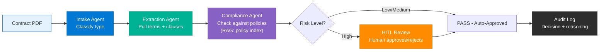

# ADR: Contract AgentOps Demo Architecture

**Decision ID**: ADR-ContractAgentOps
**Decision Title**: Architecture for Contract AgentOps Demo System
**Epic**: Contract AgentOps Demo
**Status**: Proposed
**Author**: Solution Architect Agent
**Date**: 2026-03-04
**Related PRD**: [PRD-ContractAgentOps-Demo.md](../prd/PRD-ContractAgentOps-Demo.md)
**Related UX**: [UX-ContractAgentOps-Dashboard.md](../ux/UX-ContractAgentOps-Dashboard.md)

---

## Table of Contents

1. [Context](#1-context)
2. [Decision Summary](#2-decision-summary)
3. [Options Considered](#3-options-considered)
4. [Rationale](#4-rationale)
5. [Consequences](#5-consequences)
6. [Implementation Plan](#6-implementation-plan)
7. [AI/ML Architecture](#7-aiml-architecture)
8. [References](#8-references)
9. [Review History](#9-review-history)

---

## 1. Context

### Requirements

The Contract AgentOps Demo requires an interactive, end-to-end system demonstrating 8 AgentOps lifecycle stages using Contract Management as the domain. The system must:

- Run **8 purpose-built MCP servers** exposing 30+ tools via Model Context Protocol
- Render an **8-view React dashboard** with real-time data flow and animations
- Orchestrate **4 contract agents** (Intake, Extraction, Compliance, Approval) in a sequential pipeline with HITL
- Support both **live Foundry mode** (Azure) and **simulated mode** (offline, pre-recorded responses)
- Demonstrate drift detection, evaluation suites, feedback loops, and prompt optimization
- Run locally with `clone + install + run` in under 10 minutes, optimized for 1920x1080 projector demos

### Constraints

- **Single developer** with AI assistance -- architecture must minimize complexity
- **Demo-quality** -- focus on visual impact and correctness, not production scale
- **Portability** -- must run without Azure subscription in simulated mode
- **No real data** -- all contracts, policies, and feedback are synthetic
- **Tech stack alignment** -- TypeScript for entire stack (MCP servers, agents, gateway, dashboard), single runtime (Node.js)

### Background

Organizations struggle to operationalize AI agents beyond prototypes. This demo makes the invisible visible -- showing drift, evaluations, feedback loops, and governance through interactive UI views connected to real MCP tool servers. The demo targets conference talks (15-20 min), customer workshops, and developer self-guided exploration.

---

## 2. Decision Summary

### Key Architectural Decisions

| # | Decision | Choice |
|---|----------|--------|
| D1 | MCP Server Architecture | 8 independent @modelcontextprotocol/sdk servers (TypeScript), one per AgentOps stage |
| D2 | Agent Orchestration Pattern | Sequential pipeline with HITL gate via Semantic Kernel JS / Foundry REST API |
| D3 | Frontend Framework | React 18 + TypeScript with Recharts + Tailwind CSS |
| D4 | Data Flow Architecture | Fastify + WebSocket API gateway (TypeScript) bridging React dashboard to MCP servers |
| D5 | State Management | In-memory JSON stores (no database) with file-based persistence |
| D6 | Dual-Mode Execution | Live Foundry mode + Simulated mode via adapter pattern |
| D7 | LLM Provider | Microsoft Foundry GPT-4o (primary) + GPT-4o-mini (model swap demo) |
| D8 | Evaluation Strategy | Ground-truth metrics + LLM-as-judge (GPT-4o) for qualitative scoring |

---

## 3. Options Considered

### Decision D1: MCP Server Architecture

#### Option A: Monolithic MCP Server (Single Server, All Tools)

**Description**: One MCP server exposes all 30+ tools across all 8 stages.

| Criterion | Assessment |
|-----------|------------|
| Simplicity | [PASS] Single process, single codebase |
| Demo clarity | [FAIL] Conflates stages -- audience cannot see per-stage boundaries |
| Isolation | [FAIL] One crash takes down all tools |
| Effort | Low |
| Risk | Medium -- tool naming collisions, monolith coupling |

#### Option B: 8 Independent MCP Servers (Selected)

**Description**: One @modelcontextprotocol/sdk (TypeScript) server per AgentOps stage, each exposing 3-5 tools. Servers run independently and can be tested in isolation.

| Criterion | Assessment |
|-----------|------------|
| Simplicity | [PASS] Each server is small (~100-200 lines TypeScript) |
| Demo clarity | [PASS] Each stage has its own server -- visible in Build Console |
| Isolation | [PASS] Servers start/stop independently |
| Effort | Medium |
| Risk | Low -- clear boundaries, independent testing |

#### Option C: 4 MCP Servers (One per Agent)

**Description**: MCP servers map 1:1 to agents (Intake, Extraction, Compliance, Approval), with ops tools embedded.

| Criterion | Assessment |
|-----------|------------|
| Simplicity | [PASS] Fewer servers, agent-aligned |
| Demo clarity | [FAIL] Ops stages (eval, drift, feedback) lack dedicated servers |
| Isolation | [WARN] Ops tools mixed with agent tools |
| Effort | Low-Medium |
| Risk | Medium -- ops stages feel secondary, harder to demo independently |

**Decision**: **Option B** -- 8 independent servers (TypeScript, @modelcontextprotocol/sdk). Each AgentOps stage gets a dedicated MCP server, maximizing demo clarity and stage isolation.

---

### Decision D2: Agent Orchestration Pattern

#### Option A: Direct API Calls (No Agent Framework)

**Description**: Dashboard calls MCP tools directly in sequence. No agent reasoning layer.

| Criterion | Assessment |
|-----------|------------|
| Simplicity | [PASS] No agent SDK dependency |
| AI reasoning | [FAIL] No LLM reasoning between steps -- just sequential tool calls |
| HITL support | [WARN] Possible but manual |
| Demo impact | [FAIL] Misses the "agents reasoning with tools" narrative |
| Effort | Low |

#### Option B: Semantic Kernel JS / Foundry REST API Pipeline (Selected)

**Description**: 4 agents orchestrated via Semantic Kernel JS or direct Foundry REST API calls (TypeScript). Each agent has a system prompt, tool bindings (MCP), and boundaries. Pipeline is sequential with HITL gate at Approval Agent.

| Criterion | Assessment |
|-----------|------------|
| Simplicity | [PASS] Semantic Kernel handles agent lifecycle; Foundry REST as lightweight alternative |
| AI reasoning | [PASS] Agents reason about contract context, make decisions |
| HITL support | [PASS] Custom HITL gate implementation |
| Demo impact | [PASS] Shows real agent reasoning -- the core demo value |
| Effort | Medium |

#### Option C: LangGraph / Custom DAG Orchestration

**Description**: Custom directed acyclic graph (DAG) orchestration with conditional routing.

| Criterion | Assessment |
|-----------|------------|
| Simplicity | [FAIL] Custom DAG engine adds complexity |
| AI reasoning | [PASS] Full flexibility |
| HITL support | [PASS] Custom implementation required |
| Demo impact | [WARN] Audience may focus on DAG complexity over agent reasoning |
| Effort | High |

**Decision**: **Option B** -- Semantic Kernel JS / Foundry REST API (TypeScript). Aligns with the unified TypeScript stack, provides agent reasoning, and lets agents demonstrate real LLM decision-making.

---

### Decision D3: Frontend Framework

#### Option A: Streamlit

**Description**: Python-based dashboard with built-in components.

| Criterion | Assessment |
|-----------|------------|
| Dev speed | [PASS] Fast for data apps |
| Interactivity | [FAIL] Limited animation, no custom component model |
| Design fidelity | [FAIL] Cannot implement the UX design (dark theme, animations, 8 views) |
| Effort | Low |

#### Option B: React 18 + TypeScript (Selected)

**Description**: React SPA with TypeScript, Recharts for charts, Tailwind CSS for styling.

| Criterion | Assessment |
|-----------|------------|
| Dev speed | [PASS] Component library + UX prototype already built |
| Interactivity | [PASS] Full animation control, custom components, real-time updates |
| Design fidelity | [PASS] Exact match to UX wireframes and design system |
| Effort | Medium |

#### Option C: Next.js (React + SSR)

**Description**: React with server-side rendering and API routes.

| Criterion | Assessment |
|-----------|------------|
| Dev speed | [PASS] Good, but SSR adds complexity |
| Interactivity | [PASS] Same as React |
| Design fidelity | [PASS] Same as React |
| Effort | Medium-High -- SSR overhead unnecessary for a demo |

**Decision**: **Option B** -- React 18 + TypeScript. No SSR needed (single-user demo), full control over animations and design system, and UX prototype already validates the approach.

---

### Decision D4: Data Flow Architecture

#### Option A: Dashboard Calls MCP Servers Directly

**Description**: React dashboard makes HTTP calls directly to each MCP server.

| Criterion | Assessment |
|-----------|------------|
| Simplicity | [PASS] No middleware |
| CORS/Security | [FAIL] CORS issues with 8 separate servers |
| Agent orchestration | [FAIL] Dashboard becomes an orchestrator (wrong responsibility) |
| Effort | Low |

#### Option B: Fastify + WebSocket API Gateway (Selected)

**Description**: A lightweight Fastify (TypeScript) API gateway sits between the dashboard and MCP servers. Gateway handles agent orchestration, state management, and pushes real-time updates to the dashboard via WebSocket (`ws` library).

| Criterion | Assessment |
|-----------|------------|
| Simplicity | [PASS] Single endpoint for dashboard, gateway routes to MCP servers |
| CORS/Security | [PASS] Single origin for CORS via @fastify/cors |
| Agent orchestration | [PASS] Gateway orchestrates the agent pipeline |
| Real-time | [PASS] WebSocket pushes step-by-step progress to UI |
| Stack unity | [PASS] Same language as MCP servers, agents, and dashboard |
| Effort | Medium |

#### Option C: Express.js Gateway

**Description**: Express.js gateway with Socket.IO for real-time updates.

| Criterion | Assessment |
|-----------|------------|
| Simplicity | [PASS] Well-known framework |
| CORS/Security | [PASS] Single origin |
| Performance | [WARN] Slower than Fastify for JSON serialization |
| Effort | Medium |

**Decision**: **Option B** -- Fastify + WebSocket API gateway (TypeScript). Unifies the entire backend in TypeScript (gateway + MCP servers + agents), provides single CORS origin, and enables WebSocket real-time updates to the dashboard.

---

### Decision D5: State Management & Persistence

#### Option A: PostgreSQL / SQLite Database

**Description**: Relational database for contracts, feedback, evaluations, audit trail.

| Criterion | Assessment |
|-----------|------------|
| Data integrity | [PASS] ACID transactions |
| Setup complexity | [FAIL] Database setup violates "under 10 minutes" requirement |
| Portability | [WARN] Requires database install |
| Effort | Medium |

#### Option B: In-Memory JSON Stores with File Persistence (Selected)

**Description**: TypeScript objects/Maps for runtime state, JSON files for persistence. Each MCP server manages its own data store (e.g., `data/contracts.json`, `data/feedback.json`, `data/evaluations.json`).

| Criterion | Assessment |
|-----------|------------|
| Data integrity | [WARN] No ACID -- acceptable for demo |
| Setup complexity | [PASS] Zero setup -- just files |
| Portability | [PASS] Clone and run -- no database install |
| Demo reset | [PASS] Delete JSON files to reset state |
| Effort | Low |

#### Option C: SQLite In-Process

**Description**: SQLite database embedded in the API gateway process.

| Criterion | Assessment |
|-----------|------------|
| Data integrity | [PASS] ACID |
| Setup complexity | [PASS] No install (embedded) |
| Extra complexity | [WARN] Schema migrations, ORM setup -- overkill for demo |
| Effort | Low-Medium |

**Decision**: **Option B** -- In-memory JSON. Zero setup, instant reset, maximum portability. Acceptable trade-off for a demo system.

---

### Decision D6: Dual-Mode Execution

#### Option A: Live Mode Only (Azure Required)

**Description**: All agent calls go to Foundry APIs. Demo fails without Azure access.

| Criterion | Assessment |
|-----------|------------|
| Realism | [PASS] Real LLM responses |
| Portability | [FAIL] Requires Azure subscription and internet |
| Demo reliability | [FAIL] API outages = failed demo |
| Effort | Low |

#### Option B: Adapter Pattern with Live + Simulated Modes (Selected)

**Description**: An abstraction layer between agents and the LLM provider. In **live mode**, calls hit Foundry API. In **simulated mode**, returns pre-recorded JSON responses from `data/simulated/` directory.

| Criterion | Assessment |
|-----------|------------|
| Realism | [PASS] Live mode for full Foundry showcase |
| Portability | [PASS] Simulated mode works offline, no Azure |
| Demo reliability | [PASS] Simulated mode is deterministic -- never fails |
| Effort | Medium |

#### Option C: Mock Server (Separate Mock Service)

**Description**: A separate mock HTTP server that impersonates the Foundry API.

| Criterion | Assessment |
|-----------|------------|
| Realism | [WARN] Separates mock from real in a confusing way |
| Portability | [PASS] Works offline |
| Effort | Medium-High -- maintaining a mock API server |

**Decision**: **Option B** -- Adapter pattern. Environment variable `DEMO_MODE=live|simulated` switches between real Foundry calls and pre-recorded responses. Best of both worlds.

---

### Decision D8: Evaluation Strategy -- LLM-as-Judge

#### Option A: Ground-Truth Metrics Only

**Description**: Evaluation relies solely on deterministic metrics (F1, precision, accuracy) by comparing agent outputs against annotated ground-truth data.

| Criterion | Assessment |
|-----------|------------|
| Objectivity | [PASS] Fully deterministic, reproducible |
| Quality breadth | [FAIL] Cannot assess reasoning quality, coherence, or edge-case judgment |
| Cost | [PASS] No additional LLM calls |
| Demo impact | [WARN] Metrics alone are less visually compelling |
| Effort | Low |

#### Option B: Ground-Truth + LLM-as-Judge (Selected)

**Description**: Complements ground-truth metrics with a GPT-4o judge that scores agent outputs on three qualitative dimensions: relevance (0-5), groundedness (0-5), and coherence (0-5). Judge uses structured output schema for consistent scoring.

| Criterion | Assessment |
|-----------|------------|
| Objectivity | [PASS] Ground-truth for hard metrics; judge for qualitative |
| Quality breadth | [PASS] Catches reasoning gaps, hallucinations, incoherent summaries |
| Cost | [PASS] ~5-20 judge calls per eval suite (minimal cost for demo) |
| Demo impact | [PASS] Side-by-side view of automated + AI-based evaluation -- powerful visual |
| Effort | Medium |

#### Option C: Human Evaluation Panel

**Description**: Human reviewers manually score agent outputs during evaluation.

| Criterion | Assessment |
|-----------|------------|
| Objectivity | [WARN] Subjective, reviewer-dependent |
| Quality breadth | [PASS] Full qualitative assessment |
| Scalability | [FAIL] Not suitable for automated demo flow |
| Demo impact | [FAIL] Breaks the automated demo narrative |
| Effort | High |

**Decision**: **Option B** -- Ground-truth + LLM-as-judge. Provides both deterministic and qualitative evaluation. The judge runs alongside automated metrics in the Evaluation Lab view, scoring each agent output on relevance, groundedness, and coherence. This creates a compelling side-by-side display for the demo audience.

---

## 4. Rationale

### Why This Architecture

The architecture optimizes for **demo clarity over production robustness**:

1. **8 independent MCP servers** -- Each AgentOps stage is a visible, isolated unit. The presenter can point to "this is the drift detection server" during the demo. Each server is small (~150 lines TypeScript) and testable independently.

2. **Semantic Kernel JS / Foundry REST API** -- TypeScript-native agent orchestration aligns with the unified stack. Provides agent reasoning, tool dispatch, and HITL gate -- all visible in the demo.

3. **Fastify API gateway with WebSocket** -- Keeps the entire stack in one language (TypeScript). WebSocket enables the animated "live workflow" view where contracts flow through agents in real time with step-by-step progress updates.

4. **In-memory JSON stores** -- Zero setup overhead. `git clone && npm install && npm start` gets the demo running. JSON files can be inspected for debugging and deleted for reset.

5. **Adapter pattern for dual-mode** -- Conference WiFi is unreliable. Simulated mode guarantees a successful demo. Live mode showcases real Foundry integration when Azure is available.

### Trade-offs Accepted

| Trade-off | Accepted Because |
|-----------|------------------|
| No database (no ACID) | Demo processes 5 contracts, not millions. JSON is sufficient. |
| Single-user only | Demo has one presenter. No concurrency needed. |
| No real OCR (Document Intelligence) | Simulated extraction ensures portability. Real OCR is an upgrade path. |
| No real CI/CD pipeline execution | Deploy Dashboard shows the concept; actual deployment is separate |
| JSON file persistence (not cloud) | Demo resets by deleting files. Cloud storage adds setup complexity. |

---

## 5. Consequences

### Positive

- **Fast setup**: Clone, install, run in under 10 minutes -- no database, no Azure required
- **Clear demo narrative**: Each MCP server = one stage = one UI view. The 1:1:1 mapping is easy to explain
- **Reusable architecture**: Swap the domain (contracts -> claims, invoices) by replacing prompts and sample data
- **Independent testing**: Each MCP server can be tested in isolation via CLI or Build Console view
- **Deterministic demos**: Simulated mode produces identical results every time -- reliable for conferences

### Negative

- **Not production-grade**: In-memory stores, no auth, no multi-tenancy -- intentional for demo scope
- **8 processes to manage**: Running 8 MCP servers + gateway + React dev server = 10 processes (mitigated by startup script)
- **Simulated mode may mask real issues**: Pre-recorded responses hide latency, rate limits, model variability

### Neutral

- **Unified TypeScript stack**: Single language for frontend and backend simplifies development but limits use of Python-specific ML libraries (acceptable since no model training is done in the demo)
- **WebSocket complexity**: Adds real-time capability but requires connection management code

---

## 6. Implementation Plan

### High-Level Plan

```
Phase 1: Foundation         Phase 2: AgentOps           Phase 3: Polish
+--------------------+      +--------------------+      +--------------------+
| - 5 core MCP       |      | - 3 ops MCP        |      | - Deploy view      |
|   servers           |      |   servers           |      | - Governance view  |
| - API gateway       |      | - Eval Lab view    |      | - Demo script mode |
| - 4 agents          |      | - Drift view       |      | - README + setup   |
| - Design Canvas     |      | - Feedback view    |      | - Demo recording   |
|   Build Console     |      | - Simulated drift  |      +--------------------+
|   Live Workflow     |      |   data              |
|   Monitor Panel     |      | - Ground truth      |
| - WebSocket         |      |   dataset           |
| - Simulated mode    |      +--------------------+
+--------------------+
```

### Milestones

| Milestone | Deliverables | Stories |
|-----------|-------------|---------|
| M1: Core Pipeline | 5 MCP servers, 4 agents, API gateway, WebSocket, simulated mode | US-1.x, US-2.x, US-4.x, US-5.x |
| M2: Dashboard Foundation | Design Canvas, Build Console, Live Workflow, Monitor Panel views | US-1.x, US-2.x, US-4.x, US-5.x |
| M3: AgentOps Layer | Eval, Drift, Feedback MCP servers + corresponding views | US-6.x, US-7.x, US-8.x |
| M4: Polish & Deploy | Deploy Dashboard, Governance view, demo script, README | US-3.x, US-9, US-10 |

---

## 7. AI/ML Architecture

### Model Selection

| Model | Provider | Context Window | Cost (per 1M tokens) | Latency | Selected? |
|-------|----------|---------------|----------------------|---------|-----------|
| GPT-4o | Microsoft Foundry | 128K | ~$5 input / $15 output | ~2-4s | [PASS] Primary |
| GPT-4o-mini | Microsoft Foundry | 128K | ~$0.15 input / $0.60 output | ~1-2s | [PASS] Model swap demo |
| GPT-4.1 | Microsoft Foundry | 1M | ~$2 input / $8 output | ~2-4s | [FAIL] Not needed for demo scope |

### Agent Architecture Pattern

- [x] **Multi-Agent Orchestration** -- sequential pipeline: Intake -> Extraction -> Compliance -> Approval
- [x] **Human-in-the-Loop** -- Approval Agent escalates high-risk contracts for human review
- [x] **RAG Pipeline** -- Compliance Agent retrieves from policy index; Extraction uses clause library
- [ ] Single Agent
- [ ] Reflection / Self-Correction
- [ ] Fine-tuned model

### Inference Pipeline



**Stage Details**:

1. **Intake Agent**: Receives raw contract text. Classifies by type (NDA, MSA, SOW, Amendment, SLA). Extracts basic metadata (date, parties). Routes to Extraction Agent.

2. **Extraction Agent**: Pulls structured data -- clauses, parties, dates, monetary values. Returns structured JSON with confidence scores. No judgment on compliance.

3. **Compliance Agent**: RAG retrieval from policy index (10 rules). Checks each extracted clause against policies. Returns traffic-light compliance results (pass/warn/fail) per clause with risk flags.

4. **Approval Agent**: Evaluates aggregate risk. Routes low/medium risk to auto-approval. Escalates high risk to human reviewer (HITL). Logs decision and reasoning.

### Evaluation Strategy

| Metric | Evaluator | Threshold | How Measured |
|--------|-----------|-----------|--------------|
| Extraction Accuracy | Ground truth comparison | >= 85% | F1 score against annotated contracts |
| Compliance Precision | Ground truth comparison | >= 80% | Precision of flagged clauses |
| Classification Accuracy | Ground truth comparison | >= 90% | Correct type assignment |
| False Flag Rate | Custom evaluator | < 15% | Clauses incorrectly flagged as violations |
| Latency (P95) | Timer | < 5s per agent step | End-to-end agent step timing |
| Cost per Contract | Token counter | < $0.10 | Total tokens across all 4 agents |
| Relevance (Judge) | LLM-as-judge (GPT-4o) | >= 4.0/5.0 | Judge scores agent output relevance to the input contract |
| Groundedness (Judge) | LLM-as-judge (GPT-4o) | >= 3.5/5.0 | Judge verifies claims are supported by source contract text |
| Coherence (Judge) | LLM-as-judge (GPT-4o) | >= 4.0/5.0 | Judge scores logical consistency of agent reasoning |

### AI-Specific Risks

| Risk | Impact | Mitigation |
|------|--------|------------|
| Model hallucination | High | Structured JSON output with schema validation; RAG grounding for compliance |
| Non-deterministic responses | Medium | `temperature=0`, `seed` parameter; cached responses in simulated mode |
| API rate limits | Low | Demo processes 5-20 contracts -- well within limits |
| Cost overrun | Low | Minimal token usage for demo volume; GPT-4o-mini available for cost reduction |
| Foundry API downtime | Medium | Adapter pattern: automatic fallback to simulated mode |
| Prompt injection via contract text | Medium | Input sanitization; agent boundaries prevent cross-agent data leakage |
| Judge LLM inconsistency | Low | `temperature=0` + structured output schema for judge; 3 criteria scored per output |
| Judge LLM cost overhead | Low | GPT-4o judge runs only during evaluation (not per-contract pipeline); ~5-20 calls per eval suite |

---

## 8. References

### Internal

- [PRD-ContractAgentOps-Demo.md](../prd/PRD-ContractAgentOps-Demo.md)
- [UX-ContractAgentOps-Dashboard.md](../ux/UX-ContractAgentOps-Dashboard.md)
- [HTML/CSS Prototype](../ux/prototypes/contract-agentops/index.html)

### External

- Microsoft Foundry REST API
- Semantic Kernel JS (TypeScript)
- Model Context Protocol (MCP) Specification
- @modelcontextprotocol/sdk (TypeScript MCP SDK)

---

## 9. Review History

| Date | Reviewer | Status | Notes |
|------|----------|--------|-------|
| 2026-03-04 | Solution Architect Agent | Proposed | Initial ADR covering 7 key architectural decisions |

---

**Generated by AgentX Architect Agent**
**Author**: Solution Architect Agent
**Last Updated**: 2026-03-04
**Version**: 1.0
