---
inputs:
  feature_name:
    description: "Name of the feature being specified"
    required: true
    default: "Contract AgentOps Demo"
  issue_number:
    description: "GitHub issue number for this feature"
    required: true
    default: ""
  epic_id:
    description: "Parent Epic issue number"
    required: false
    default: ""
  author:
    description: "Spec author (agent or person)"
    required: false
    default: "Solution Architect Agent"
  date:
    description: "Specification date (YYYY-MM-DD)"
    required: false
    default: "2026-03-04"
---

# Technical Specification: Contract AgentOps Demo

**Feature**: Contract AgentOps Demo - Full System
**Epic**: Contract AgentOps Demo
**Status**: Draft
**Author**: Solution Architect Agent
**Date**: 2026-03-04
**Related PRD**: [PRD-ContractAgentOps-Demo.md](../prd/PRD-ContractAgentOps-Demo.md)
**Related ADR**: [ADR-ContractAgentOps-Demo.md](../adr/ADR-ContractAgentOps-Demo.md)
**Related UX**: [UX-ContractAgentOps-Dashboard.md](../ux/UX-ContractAgentOps-Dashboard.md)

> **Acceptance Criteria**: Defined in the PRD user stories - see [PRD-ContractAgentOps-Demo.md](../prd/PRD-ContractAgentOps-Demo.md#5-user-stories--features). Engineers should track AC completion against the originating Story issue.

---

## Table of Contents

1. [Overview](#1-overview)
2. [Architecture Diagrams](#2-architecture-diagrams)
3. [API Design](#3-api-design)
4. [Data Model Diagrams](#4-data-model-diagrams)
5. [Service Layer Diagrams](#5-service-layer-diagrams)
6. [Security Diagrams](#6-security-diagrams)
7. [Performance](#7-performance)
8. [Testing Strategy](#8-testing-strategy)
9. [Implementation Notes](#9-implementation-notes)
10. [Rollout Plan](#10-rollout-plan)
11. [Risks & Mitigations](#11-risks--mitigations)
12. [Monitoring & Observability](#12-monitoring--observability)
13. [AI/ML Specification](#13-aiml-specification) *(if applicable)*

---

## 1. Overview

### Feature Summary

An end-to-end Contract AgentOps Demo system consisting of 8 MCP servers (TypeScript/@modelcontextprotocol/sdk), 4 AI agents (Microsoft Foundry GPT-4o), a Fastify API gateway (TypeScript) with WebSocket, and a static dashboard UI (vanilla HTML/CSS/JS). The system demonstrates 8 AgentOps lifecycle stages: Design, Build, Deploy, Run, Monitor, Evaluate, Detect (Drift), and Feedback.

> **Architecture Update (2026-03-07)**: The React dashboard (`dashboard/`) has been archived. The primary UI is now the static dashboard under `ui/` served by the gateway at `http://localhost:8000`. All port 3000 references in this spec are historical.

### Technical Scope

| Component | Technology | Count |
|-----------|------------|-------|
| MCP Servers | TypeScript + @modelcontextprotocol/sdk | 8 servers, 30+ tools |
| AI Agents | Semantic Kernel JS / Foundry REST API + GPT-4o | 4 agents (Intake, Extraction, Compliance, Approval) |
| API Gateway | TypeScript + Fastify + ws (WebSocket) | 1 gateway |
| Dashboard | Static HTML/CSS/JS (vanilla, no build step) | 8 views, served by gateway |
| Data Store | In-memory JSON with file persistence | 6 JSON files |
| Prompts | Markdown files in `prompts/` | 4 agent prompts + system instructions |
| LLM (Judge) | Microsoft Foundry GPT-4o (LLM-as-judge) | Evaluation scoring |

### Out of Scope (Per ADR)

- Production database, authentication, multi-tenancy
- Real Azure Document Intelligence OCR
- Real CI/CD pipeline execution
- Mobile-responsive optimization

### Success Criteria

- All 8 MCP servers healthy and responding on ports 9001-9008
- 4 AI agents process contracts end-to-end in both live and simulated modes
- Dashboard renders all 8 views with real-time WebSocket updates
- Evaluation suite achieves >= 85% accuracy on 20 ground-truth contract cases
- Full pipeline (4 agents) completes in < 30 seconds in live mode
- Single `npm start` command launches entire system
- Simulated mode works without any Azure credentials
- HITL escalation triggers correctly for high-risk contracts

---

## 2. Architecture Diagrams

### 2.1 High-Level System Architecture

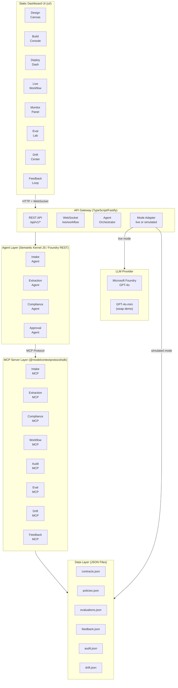

### 2.2 Agent Pipeline Sequence

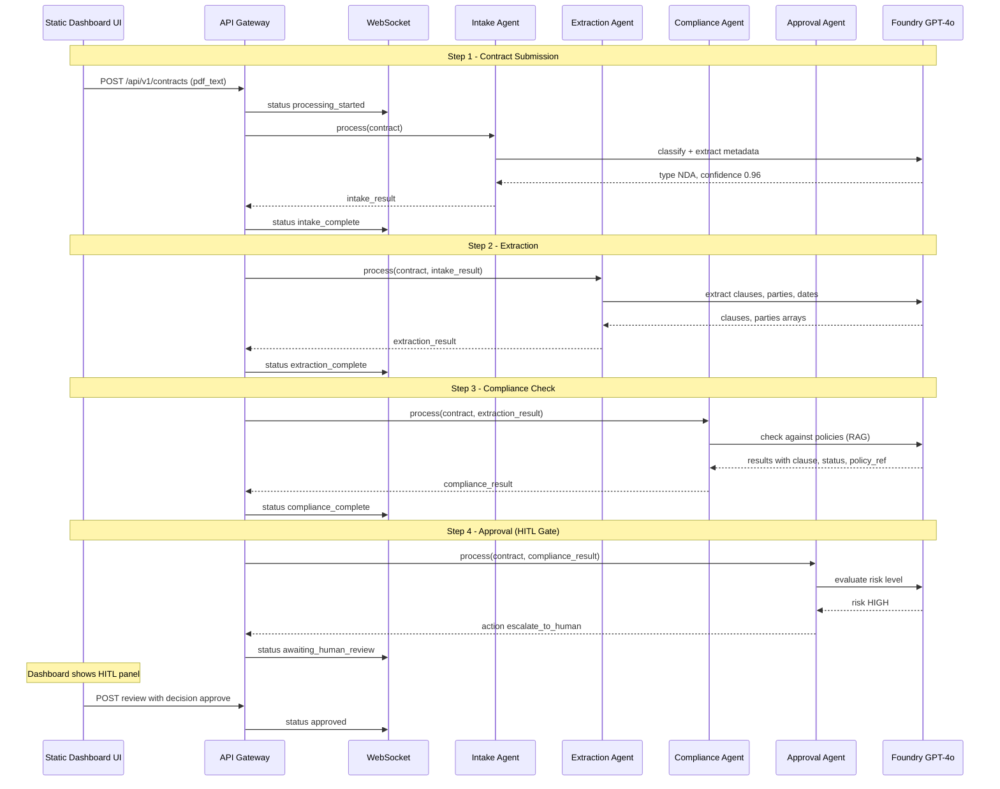

### 2.3 MCP Server Internal Architecture

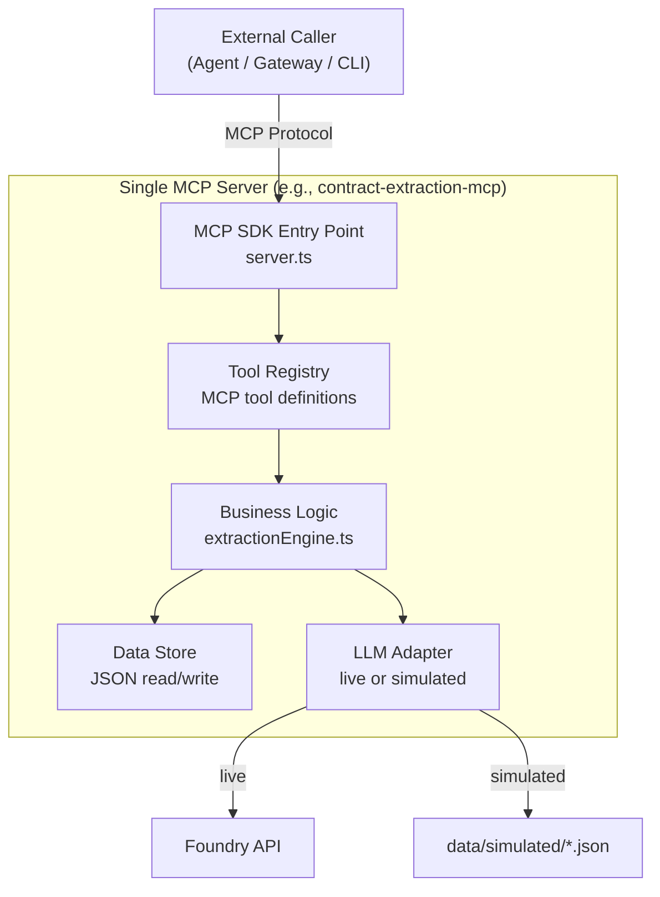

### 2.4 Component Architecture (Dashboard UI)

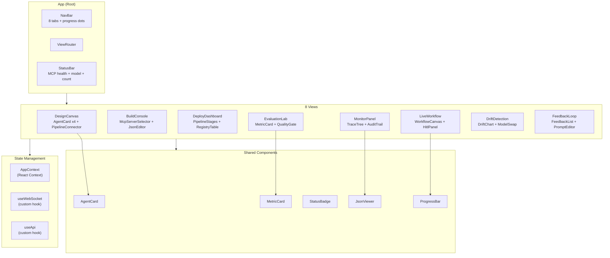

### 2.5 Dual-Mode Adapter Pattern

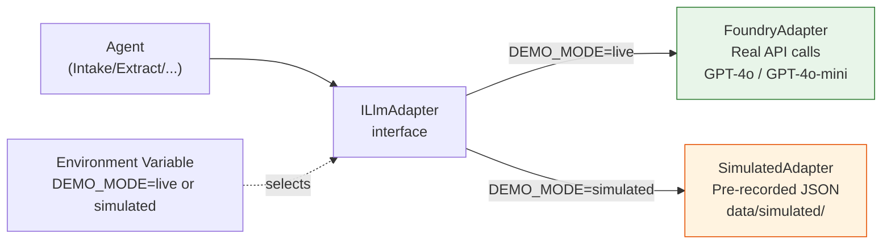

---

## 3. API Design

### 3.1 API Gateway Endpoints

| Method | Endpoint | Description | WebSocket Push |
|--------|----------|-------------|----------------|
| GET | `/api/v1/health` | Health check for gateway + all MCP servers | No |
| POST | `/api/v1/contracts` | Submit a contract for processing (triggers pipeline) | Yes -- step-by-step progress |
| GET | `/api/v1/contracts` | List all processed contracts | No |
| GET | `/api/v1/contracts/{id}` | Get contract details + processing results | No |
| POST | `/api/v1/contracts/{id}/review` | Submit HITL review decision | Yes -- approval status |
| POST | `/api/v1/tools/{server}/{tool}` | Execute a single MCP tool (Build Console) | No |
| GET | `/api/v1/tools` | List all MCP servers and their tools | No |
| POST | `/api/v1/evaluations/run` | Run evaluation suite | Yes -- per-contract progress |
| GET | `/api/v1/evaluations/results` | Get latest evaluation results | No |
| GET | `/api/v1/evaluations/baseline` | Get baseline comparison | No |
| GET | `/api/v1/drift/llm` | Get LLM drift timeline data | No |
| GET | `/api/v1/drift/data` | Get data drift analysis | No |
| POST | `/api/v1/drift/model-swap` | Simulate model swap comparison | No |
| POST | `/api/v1/feedback` | Submit feedback on agent output | No |
| GET | `/api/v1/feedback/summary` | Get feedback trends and summary | No |
| POST | `/api/v1/feedback/optimize` | Convert feedback to test cases + re-evaluate | Yes -- optimization progress |
| GET | `/api/v1/audit/{contract_id}` | Get decision audit trail for a contract | No |
| GET | `/api/v1/traces/{contract_id}` | Get trace data (agent steps, tool calls, latency) | No |
| POST | `/api/v1/deploy/pipeline` | Trigger simulated deployment pipeline | Yes -- stage progress |
| POST | `/api/v1/prompts/{agent}` | Update agent prompt (Feedback view) | No |
| WS | `/ws/workflow` | WebSocket for real-time pipeline progress | N/A |

### 3.2 Key Request/Response Contracts

#### POST /api/v1/contracts

**Request Body:**
```json
{
    "text": "This Non-Disclosure Agreement is entered into...",
    "filename": "NDA-Acme-Beta-2026.pdf",
    "source": "upload"
}
```

**Response (202 Accepted):**
```json
{
    "contract_id": "contract-001",
    "status": "processing",
    "message": "Contract submitted. Follow /ws/workflow for real-time updates."
}
```

#### WebSocket /ws/workflow Messages

```json
{
    "event": "agent_step_complete",
    "contract_id": "contract-001",
    "agent": "intake",
    "status": "complete",
    "result": {
        "type": "NDA",
        "confidence": 0.96,
        "parties": ["Acme Corp", "Beta Inc"]
    },
    "latency_ms": 1200,
    "tokens": {"input": 342, "output": 128},
    "timestamp": "2026-03-04T10:03:45Z"
}
```

#### POST /api/v1/tools/{server}/{tool}

**Request Body:**
```json
{
    "input": {
        "text": "Recipient shall not disclose any Confidential Information..."
    }
}
```

**Response (200 OK):**
```json
{
    "output": {
        "clauses": [
            {"type": "confidentiality", "text": "...", "section": "3.1"}
        ],
        "confidence": 0.94
    },
    "latency_ms": 1200,
    "tokens": {"input": 342, "output": 198},
    "status": "success"
}
```

#### POST /api/v1/contracts/{id}/review

**Request Body:**
```json
{
    "decision": "approve",
    "reviewer": "Piyush",
    "comment": "Acceptable for this strategic partner"
}
```

**Response (200 OK):**
```json
{
    "contract_id": "contract-001",
    "decision": "approve",
    "status": "archived",
    "timestamp": "2026-03-04T10:04:52Z"
}
```

### 3.3 Error Response Format

```json
{
    "error": "ValidationError",
    "message": "Contract text is required",
    "details": {"field": "text", "reason": "required"},
    "request_id": "req-abc-123"
}
```

| Status Code | Usage |
|-------------|-------|
| 200 | Successful read/update |
| 202 | Contract submitted (async processing) |
| 400 | Validation error (missing/invalid fields) |
| 404 | Resource not found |
| 500 | Internal server error |
| 503 | MCP server unavailable |

---

## 4. Data Model Diagrams

### 4.1 Core Entities

```mermaid
erDiagram
    contracts {
        string id PK "contract-001"
        string filename "NDA-Acme-Beta.pdf"
        string text "Full contract text"
        string type "NDA|MSA|SOW|Amendment|SLA"
        string status "processing|awaiting_review|approved|rejected|archived"
        float classification_confidence "0.96"
        datetime submitted_at "2026-03-04T10:03:00Z"
        datetime completed_at "2026-03-04T10:05:00Z"
    }

    extraction_results {
        string id PK
        string contract_id FK
        json clauses "array of extracted clauses"
        json parties "array of identified parties"
        json dates "array of key dates"
        json values "array of monetary values"
        float confidence "overall extraction confidence"
    }

    compliance_results {
        string id PK
        string contract_id FK
        json clause_results "per-clause pass/warn/fail"
        string overall_risk "low|medium|high|critical"
        int flags_count "number of flagged clauses"
        json policy_references "matched policy rules"
    }

    review_decisions {
        string id PK
        string contract_id FK
        string decision "approve|reject|request_changes"
        string reviewer "reviewer name"
        string comment "review comment"
        datetime decided_at
    }

    audit_entries {
        string id PK
        string contract_id FK
        string agent "intake|extraction|compliance|approval|human"
        string action "classified|extracted|flagged|escalated|approved"
        string reasoning "agent reasoning text"
        datetime timestamp
    }

    trace_entries {
        string id PK
        string contract_id FK
        string agent "agent name"
        string tool "MCP tool name"
        json input "tool input JSON"
        json output "tool output JSON"
        int latency_ms "execution time"
        int tokens_in "input tokens"
        int tokens_out "output tokens"
        datetime timestamp
    }

    evaluations {
        string id PK
        string version "v1.3"
        datetime run_at
        int total_cases "20"
        int passed "17"
        float accuracy "0.85"
        json per_metric "metric breakdown"
        json per_contract "per-contract results"
        string quality_gate "PASS|FAIL"
    }

    drift_data {
        string id PK
        string type "llm_drift|data_drift|model_swap"
        json timeline "weekly accuracy data points"
        json distribution "contract type distribution"
        json alerts "detected drift events"
        datetime generated_at
    }

    feedback_entries {
        string id PK
        string contract_id FK
        string agent "agent that produced the output"
        string sentiment "positive|negative"
        string comment "reviewer feedback text"
        string reviewer "feedback author"
        datetime submitted_at
        boolean converted_to_test "false"
    }

    contracts ||--o| extraction_results : "has"
    contracts ||--o| compliance_results : "has"
    contracts ||--o| review_decisions : "has"
    contracts ||--o{ audit_entries : "has many"
    contracts ||--o{ trace_entries : "has many"
    contracts ||--o{ feedback_entries : "has many"
```

### 4.2 JSON File Storage Layout

```
data/
    contracts.json          # Array of contract records + results
    policies.json           # 10 company policy rules (static)
    clauses.json            # 50 standard clause definitions (static)
    evaluations.json        # Evaluation run results
    drift.json              # Simulated drift timeline data
    feedback.json           # User feedback entries
    audit.json              # Decision audit trail
    simulated/              # Pre-recorded LLM responses
        intake/
            nda-001.json
            msa-001.json
            ...
        extraction/
            nda-001.json
            ...
        compliance/
            nda-001.json
            ...
        approval/
            nda-001.json
            ...
    ground-truth/           # Evaluation ground truth
        nda-001-truth.json
        msa-001-truth.json
        ...
    sample-contracts/       # 5 sample contract PDFs
        NDA-Acme-Beta-2026.pdf
        MSA-GlobalTech-2026.pdf
        SOW-CloudMigration-2026.pdf
        Amendment-DataPolicy-2026.pdf
        SLA-InfraUptime-2026.pdf
```

---

## 5. Service Layer Diagrams

### 5.1 Backend Architecture (TypeScript)

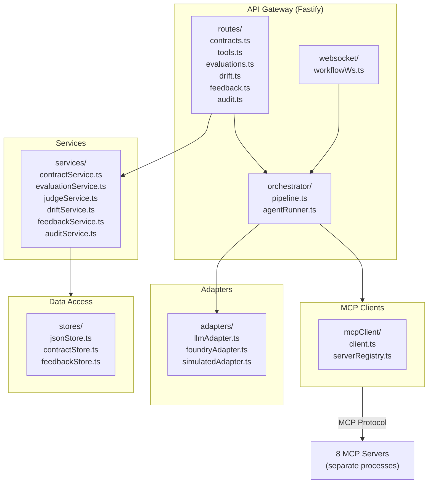

### 5.2 MCP Server Internal Structure (Per Server)

```
mcp-servers/
    contract-intake-mcp/
        server.ts               # @modelcontextprotocol/sdk entry point + tool definitions
        engine.ts               # Business logic (classify, extract metadata)
        index.ts
    contract-extraction-mcp/
        server.ts
        engine.ts               # Clause extraction, party identification
    contract-compliance-mcp/
        server.ts
        engine.ts               # Policy checking, risk flagging
    contract-workflow-mcp/
        server.ts
        engine.ts               # Approval routing, HITL escalation
    contract-audit-mcp/
        server.ts
        engine.ts               # Decision logging, report generation
    contract-eval-mcp/
        server.ts
        engine.ts               # Evaluation suite runner, quality gate, LLM-as-judge
    contract-drift-mcp/
        server.ts
        engine.ts               # Drift detection, model swap simulation
    contract-feedback-mcp/
        server.ts
        engine.ts               # Feedback collection, improvement cycle
```

### 5.3 Agent Definitions

```
agents/
    intakeAgent.ts              # Agent definition: system prompt, tool bindings
    extractionAgent.ts
    complianceAgent.ts
    approvalAgent.ts
    agentConfig.ts              # Shared agent configuration

prompts/
    intake-system.md            # System prompt for Intake Agent
    extraction-system.md        # System prompt for Extraction Agent
    compliance-system.md        # System prompt for Compliance Agent
    approval-system.md          # System prompt for Approval Agent
```

---

## 6. Security Diagrams

### 6.1 Security Model (Demo Context)

This is a demo system -- security is simplified but follows best practices where applicable.

| Layer | Implementation | Notes |
|-------|---------------|-------|
| Authentication | None (single-user demo) | Future: Entra ID for multi-user |
| Authorization | None (single-user demo) | Demonstrated conceptually in Deploy view |
| API Keys | Environment variables (`FOUNDRY_API_KEY`) | Never hardcoded, `.env` file excluded from git |
| Input Validation | JSON schema validation on all endpoints | Prevents malformed requests |
| Prompt Injection | Input sanitization before LLM calls | Strip control characters, limit input length |
| CORS | Gateway origin (localhost:8000) | Gateway allows its own origin for the static UI |
| Data Protection | All data is synthetic | No PII, no real contracts |
| Secret Management | `.env` file + `.gitignore` | Keys never committed to repository |

### 6.2 Input Sanitization Pipeline

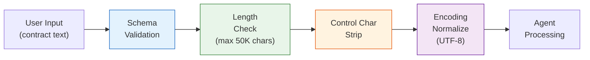

---

## 7. Performance

### 7.1 Performance Requirements

| Metric | Target | Measurement |
|--------|--------|-------------|
| Contract Pipeline (end-to-end) | < 30 seconds | All 4 agents complete |
| Per-Agent Step | < 10 seconds | Individual agent processing |
| Dashboard Load | < 2 seconds | Initial page render |
| WebSocket Latency | < 100ms | Status update delivery |
| MCP Tool Call | < 5 seconds | Single tool execution |
| Evaluation Suite (20 cases) | < 3 minutes | Full evaluation run |
| API Response (non-LLM) | < 200ms | Data retrieval endpoints |

### 7.2 Optimization Strategies

- **Simulated mode**: Instant responses (no LLM latency) for rehearsal and testing
- **WebSocket streaming**: Dashboard receives step-by-step updates instead of polling
- **Agent parallelism**: Not applicable (sequential pipeline by design) -- but audit logging is async
- **JSON file caching**: Data loaded at server startup, written on change
- **React optimizations**: `React.memo` for stable components, lazy loading for views

---

## 8. Testing Strategy

### 8.1 Test Pyramid

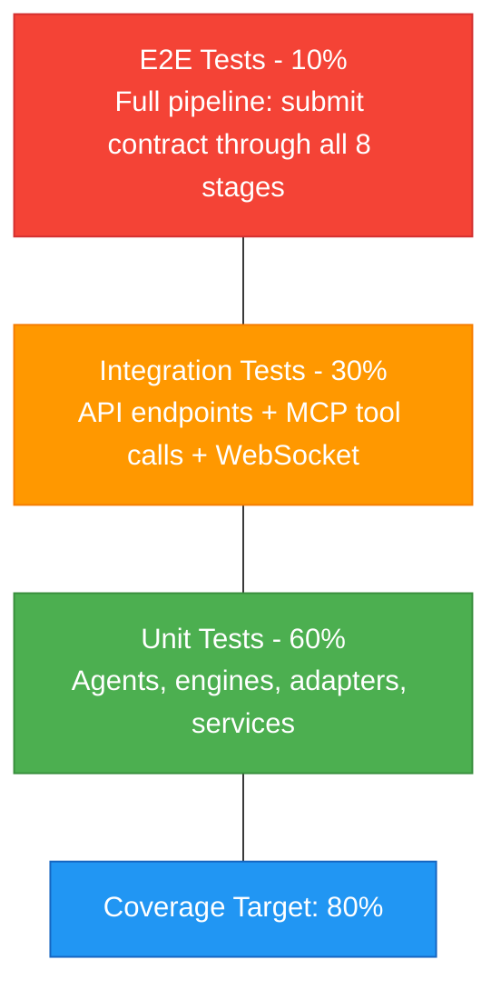

### 8.2 Test Types

| Test Type | Scope | Framework | Key Tests |
|-----------|-------|-----------|-----------|
| Unit | Agent engines, adapters, stores | Vitest | Classification logic, extraction parsing, policy matching |
| Unit | React components | Vitest + React Testing Library | Component rendering, state updates, event handlers |
| Integration | API endpoints | Vitest + supertest | Contract submission, HITL review, evaluation run |
| Integration | MCP tools | Vitest | Each MCP tool with sample inputs |
| Integration | WebSocket | Vitest | Real-time event delivery |
| E2E | Full pipeline | Playwright | Submit contract -> view in all 8 views |
| E2E | Simulated mode | Playwright | Same pipeline with simulated LLM responses |

### 8.3 Evaluation Tests (AI-Specific)

| Test Case | Ground Truth | Metric | Threshold |
|-----------|-------------|--------|-----------|
| NDA classification | type: "NDA" | Classification accuracy | 100% (5/5 sample contracts) |
| Clause extraction (NDA) | 4 clauses annotated | F1 score | >= 85% |
| Compliance flagging (MSA) | 2 policy violations | Precision | >= 80% |
| Risk level assessment | High risk for specific contract | Correct risk assignment | 100% (binary) |
| HITL escalation | High risk triggers escalation | Correct routing | 100% |

---

## 9. Implementation Notes

### 9.1 Project Directory Structure

```
contract-agentops-demo/
    README.md                       # Setup instructions + demo guide
    package.json                    # Root package.json (npm workspaces monorepo)
    tsconfig.base.json              # Shared TypeScript configuration
    .env.example                    # Environment variable template
    start.ts                        # One-command startup (all servers + gateway)
    start.sh                        # Bash startup script
    start.ps1                       # PowerShell startup script

    gateway/                        # API Gateway (Fastify + ws)
        package.json
        tsconfig.json
        src/
            index.ts                # Fastify app entry point
            routes/
                contracts.ts
                tools.ts
                evaluations.ts
                drift.ts
                feedback.ts
                audit.ts
                deploy.ts
            websocket/
                workflowWs.ts       # WebSocket handler for real-time updates
            orchestrator/
                pipeline.ts         # Agent pipeline orchestration
                agentRunner.ts      # Agent execution wrapper
            adapters/
                llmAdapter.ts       # ILlmAdapter interface
                foundryAdapter.ts   # Live Foundry API calls
                simulatedAdapter.ts # Pre-recorded JSON responses
            services/
                contractService.ts
                evaluationService.ts
                judgeService.ts     # LLM-as-judge evaluation scoring
                driftService.ts
                feedbackService.ts
                auditService.ts
            stores/
                jsonStore.ts        # Base JSON file store
                contractStore.ts
                feedbackStore.ts
            config.ts               # Configuration (ports, mode, paths)

    mcp-servers/                    # 8 MCP Servers (@modelcontextprotocol/sdk)
        contract-intake-mcp/
            package.json
            src/
                server.ts
                engine.ts
        contract-extraction-mcp/
            package.json
            src/
                server.ts
                engine.ts
        contract-compliance-mcp/
            package.json
            src/
                server.ts
                engine.ts
        contract-workflow-mcp/
            package.json
            src/
                server.ts
                engine.ts
        contract-audit-mcp/
            package.json
            src/
                server.ts
                engine.ts
        contract-eval-mcp/
            package.json
            src/
                server.ts
                engine.ts           # Includes LLM-as-judge scoring
        contract-drift-mcp/
            package.json
            src/
                server.ts
                engine.ts
        contract-feedback-mcp/
            package.json
            src/
                server.ts
                engine.ts

    agents/                         # Agent Definitions
        package.json
        src/
            intakeAgent.ts
            extractionAgent.ts
            complianceAgent.ts
            approvalAgent.ts
            agentConfig.ts

    prompts/                        # Agent System Prompts (Markdown)
        intake-system.md
        extraction-system.md
        compliance-system.md
        approval-system.md

    ui/                             # Static Dashboard UI (vanilla HTML/CSS/JS)
        index.html                  # Main HTML with 8-view tabs
        app.js                      # Simulated mode interactions + animations
        api.js                      # Real-mode API integration + WebSocket
        styles.css                  # Dashboard styles

    dashboard/                      # [ARCHIVED] React Dashboard (not in runtime)

    data/                           # Data Files
        contracts.json
        policies.json
        clauses.json
        evaluations.json
        drift.json
        feedback.json
        audit.json
        simulated/                  # Pre-recorded LLM responses
            intake/
            extraction/
            compliance/
            approval/
        ground-truth/               # Evaluation ground truth
        sample-contracts/           # 5 sample contract PDFs

    tests/                          # Tests (Vitest + Playwright)
        unit/
            intakeEngine.test.ts
            extractionEngine.test.ts
            complianceEngine.test.ts
            adapters.test.ts
            stores.test.ts
            judgeService.test.ts
        integration/
            apiContracts.test.ts
            apiEvaluations.test.ts
            mcpTools.test.ts
            websocket.test.ts
        e2e/
            fullPipeline.test.ts
```

### 9.2 Startup Sequence

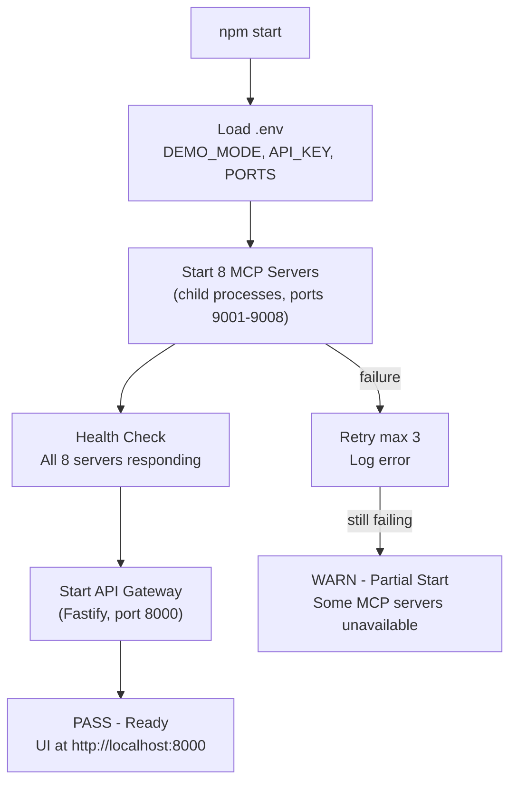

### 9.3 Port Assignments

| Component | Port | Notes |
|-----------|------|-------|
| Static UI + API Gateway | 8000 | Fastify serves UI at / and API at /api/v1/* |
| contract-intake-mcp | 9001 | MCP over SSE |
| contract-extraction-mcp | 9002 | MCP over SSE |
| contract-compliance-mcp | 9003 | MCP over SSE |
| contract-workflow-mcp | 9004 | MCP over SSE |
| contract-audit-mcp | 9005 | MCP over SSE |
| contract-eval-mcp | 9006 | MCP over SSE |
| contract-drift-mcp | 9007 | MCP over SSE |
| contract-feedback-mcp | 9008 | MCP over SSE |

### 9.4 Environment Variables

```bash
# .env.example
DEMO_MODE=simulated              # "live" or "simulated"
FOUNDRY_API_KEY=                  # Required for live mode only
FOUNDRY_ENDPOINT=                 # Foundry API endpoint (live mode)
FOUNDRY_MODEL=gpt-4o             # Primary model
FOUNDRY_MODEL_SWAP=gpt-4o-mini   # Model for swap demo
GATEWAY_PORT=8000
DASHBOARD_PORT=3000
MCP_BASE_PORT=9001               # MCP servers use 9001-9008
LOG_LEVEL=INFO
```

---

## 10. Rollout Plan

### Phase 1: Foundation (Core Pipeline)

**Goal**: Working contract pipeline with 5 MCP servers + 4 views

| Deliverable | Stories |
|-------------|---------|
| 5 core MCP servers (Intake, Extraction, Compliance, Workflow, Audit) | US-1.3, US-2.3, US-3.3, US-4.3, US-5.3 |
| 4 AI agents with prompts | US-1.1, US-1.2, US-2.1, US-4.1 |
| API gateway with WebSocket | (infrastructure) |
| Simulated mode adapter | (infrastructure) |
| Design Canvas + Build Console views | US-1.1, US-1.2, US-2.1, US-2.2 |
| Live Workflow + Monitor Panel views | US-4.1, US-4.2, US-5.1, US-5.2 |
| 5 sample contracts with ground truth | (data) |
| Startup script (`npm start`) | (infrastructure) |

### Phase 2: AgentOps Layer

**Goal**: Ops capabilities with 3 more MCP servers + 3 views

| Deliverable | Stories |
|-------------|---------|
| Evaluation MCP server | US-6.4, US-6.5 |
| Drift Detection MCP server | US-7.4 |
| Feedback MCP server | US-8.5 |
| Evaluation Lab view | US-6.1, US-6.2, US-6.3 |
| Drift Detection Center view | US-7.1, US-7.2, US-7.3 |
| Feedback & Optimize Loop view | US-8.1, US-8.2, US-8.3, US-8.4 |
| Simulated drift data (4-week curve) | US-7.1 |
| Ground truth evaluation dataset (20 cases) | US-6.1 |
| Prompt editor with re-evaluation | US-8.4 |

### Phase 3: Polish

**Goal**: Complete demo with governance + guided mode

| Deliverable | Stories |
|-------------|---------|
| Deploy Dashboard view | US-3.1, US-3.2 |
| Agent 365 Governance view (P2) | US-9 |
| Demo script mode with presenter notes (P2) | US-10 |
| README with setup instructions | (docs) |
| Demo recording for async sharing | (docs) |

---

## 11. Risks & Mitigations

| Risk | Impact | Probability | Mitigation |
|------|--------|-------------|------------|
| Foundry API unavailable during demo | High | Low | Simulated mode with pre-recorded responses |
| 10 processes hard to start/manage | Medium | Medium | Single `npm start` script manages all processes via npm workspaces |
| WebSocket connection drops during demo | Medium | Low | Auto-reconnect logic + fallback to polling |
| MCP SDK breaking changes (preview) | Medium | Medium | Pin versions in package.json lockfile, abstract MCP layer |
| Non-deterministic LLM responses | Medium | High | `temperature=0`, `seed` param, cached simulated responses |
| Large JSON files slow performance | Low | Low | Demo processes ~20 contracts max; file size negligible |
| React build failures on different Node versions | Low | Medium | Pin Node version in `.nvmrc`, use lockfile |
| TypeScript compilation errors across workspaces | Low | Medium | Shared tsconfig.base.json, strict mode, CI type-checking |

---

## 12. Monitoring & Observability

### 12.1 Demo Health Dashboard (StatusBar)

The React StatusBar component shows real-time system health:

```
+-------------------------------------------------------------------------------------+
| MCP: 8/8 [PASS] | Model: GPT-4o | Mode: Live | Contracts: 3 processed | WS: [PASS] |
+-------------------------------------------------------------------------------------+
```

### 12.2 Logging Strategy

| Component | Log Format | Output |
|-----------|------------|--------|
| API Gateway | Structured JSON | stdout + `logs/gateway.log` |
| MCP Servers | Structured JSON | stdout + `logs/mcp-{name}.log` |
| Agent Pipeline | Structured JSON (per-step) | stdout + stored in trace_entries |
| Static Dashboard UI | Browser console | DevTools |

### 12.3 Key Operational Metrics (Displayed in Monitor Panel)

| Metric | Source | Visualization |
|--------|--------|---------------|
| Per-agent latency | Trace entries | Horizontal bar chart |
| Token usage per step | Trace entries | Table |
| Tool call success rate | MCP server logs | Status badges |
| Pipeline completion rate | Contract store | Counter |
| HITL escalation rate | Audit entries | Percentage |
| Evaluation pass rate | Evaluation results | Quality gate card |
| Drift threshold crossing | Drift data | Line chart with alert |
| Feedback sentiment ratio | Feedback entries | Bar chart |

---

## 13. AI/ML Specification

### 13.1 Model Configuration

| Parameter | Value |
|-----------|-------|
| **Primary Model** | GPT-4o |
| **Provider** | Microsoft Foundry |
| **Endpoint** | Environment variable `FOUNDRY_ENDPOINT` |
| **Authentication** | API key via `FOUNDRY_API_KEY` env var |
| **Temperature** | 0.0 (deterministic for demo reliability) |
| **Top-P** | 1.0 |
| **Max Tokens** | 2048 (sufficient for contract analysis) |
| **Structured Output** | JSON mode with schema validation |
| **Timeout** | 30 seconds |
| **Retry Policy** | 2 retries with exponential backoff (1s, 3s) |
| **Swap Model** | GPT-4o-mini (for model swap demo in Drift view) |

#### Judge Model Configuration (LLM-as-Judge)

| Parameter | Value |
|-----------|-------|
| **Model** | GPT-4o |
| **Purpose** | Qualitative evaluation scoring of agent outputs |
| **Temperature** | 0.0 (deterministic scoring) |
| **Structured Output** | JSON schema with 3 scores: relevance, groundedness, coherence (0-5 each) |
| **Scoring Criteria** | Relevance: output addresses the contract input. Groundedness: claims supported by source text. Coherence: logical consistency of reasoning. |
| **Invocation** | Per-contract during evaluation suite run (not per-pipeline run) |
| **Cost Impact** | ~5-20 additional GPT-4o calls per evaluation suite (minimal) |

### 13.2 Agent Tool Bindings

| Agent | MCP Server | Tools | Side Effects |
|-------|-----------|-------|--------------|
| Intake Agent | contract-intake-mcp | `upload_contract`, `classify_document`, `extract_metadata` | Write to contracts.json |
| Extraction Agent | contract-extraction-mcp | `extract_clauses`, `identify_parties`, `extract_dates_values` | Write extraction_results |
| Compliance Agent | contract-compliance-mcp | `check_policy`, `flag_risk`, `get_policy_rules` | Write compliance_results |
| Approval Agent | contract-workflow-mcp | `route_approval`, `escalate_to_human`, `notify_stakeholder` | Write review state, audit |

### 13.3 Agent Pipeline Behavior

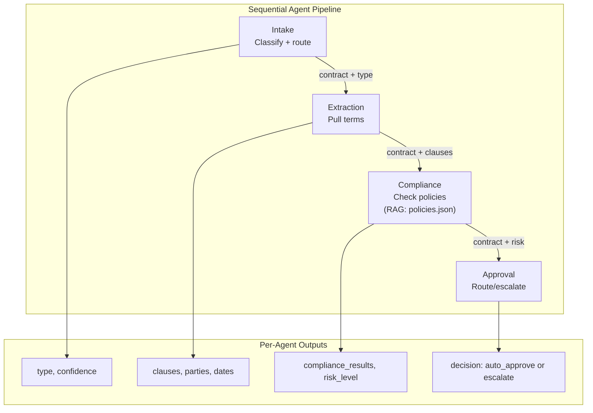

### 13.4 RAG Design (Compliance Agent)

| Parameter | Value |
|-----------|-------|
| **Knowledge Source** | `data/policies.json` (10 rules) + `data/clauses.json` (50 clauses) |
| **Retrieval Method** | Direct JSON lookup (no vector store -- small dataset) |
| **Matching Strategy** | Policy rules matched by clause type + keyword overlap |
| **Chunk Strategy** | N/A (policies are pre-structured as rules) |

### 13.5 Evaluation Strategy

| Metric | Evaluator | Threshold | Test Dataset |
|--------|-----------|-----------|--------------|
| Extraction Accuracy | Ground truth F1 | >= 85% | `data/ground-truth/` (20 cases) |
| Compliance Precision | Ground truth comparison | >= 80% | `data/ground-truth/` |
| Classification Accuracy | Exact match | >= 90% | 5 sample contracts |
| False Flag Rate | Ground truth negatives | < 15% | `data/ground-truth/` |
| Latency P95 | Timer | < 5s per step | Live mode runs |
| Cost per Contract | Token counter | < $0.10 | Token logs |
| Relevance (Judge) | LLM-as-judge (GPT-4o) | >= 4.0/5.0 | Judge scores per evaluation run |
| Groundedness (Judge) | LLM-as-judge (GPT-4o) | >= 3.5/5.0 | Judge scores per evaluation run |
| Coherence (Judge) | LLM-as-judge (GPT-4o) | >= 4.0/5.0 | Judge scores per evaluation run |

### 13.6 Observability

- **Tracing**: Per-agent trace entries with input/output, latency, and token counts stored in `trace_entries`
- **Token Tracking**: Input tokens and output tokens logged per agent step and per tool call
- **Quality Monitoring**: Evaluation scores tracked per run via `evaluations.json`; quality gate (PASS/FAIL) computed against thresholds
- **Drift Monitoring**: Weekly accuracy timeline in `drift.json`; alerts triggered when accuracy drops below threshold
- **Dashboard**: Monitor Panel view (View 5) displays real-time traces, token usage, latency charts, and audit trail

### 13.7 Drift Simulation Data

The Drift Detection MCP server uses pre-generated simulation data:

| Drift Type | Data Pattern | Source |
|-----------|-------------|--------|
| LLM Drift | 4-week accuracy decline: 92% -> 88% -> 84% -> 81% | `data/drift.json` |
| Data Drift | New "AI Liability" clause type appearing in 15% of contracts | `data/drift.json` |
| Model Swap | GPT-4o vs GPT-4o-mini: accuracy (-3.1%), latency (-52%), cost (-60%) | Computed on-demand |

---

## Cross-Cutting Concerns Diagram

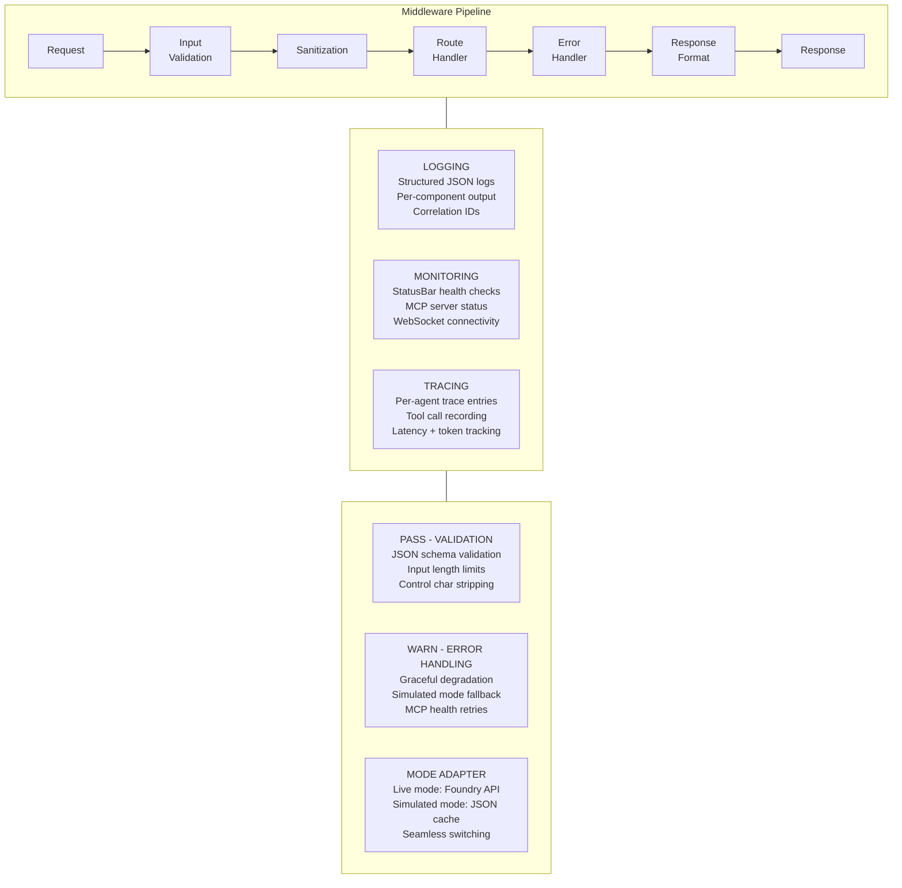

---

**Generated by AgentX Architect Agent**
**Author**: Solution Architect Agent
**Last Updated**: 2026-03-04
**Version**: 1.0
