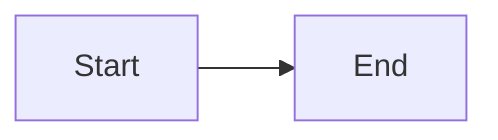
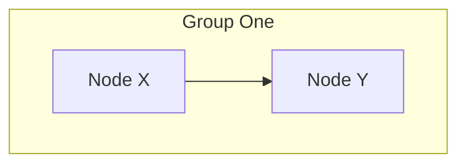
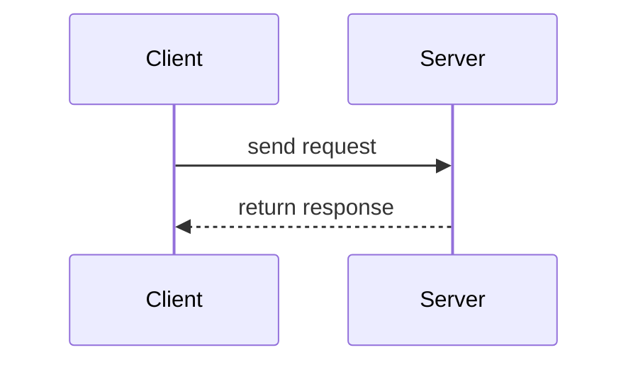
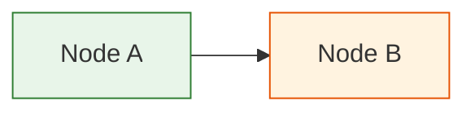
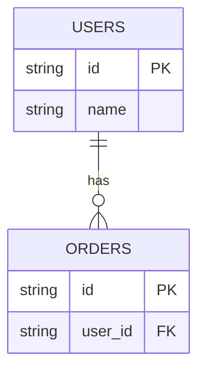
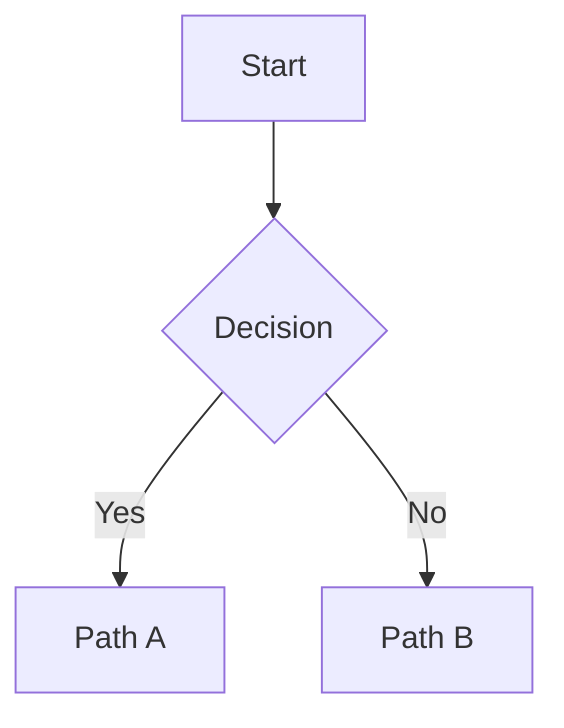
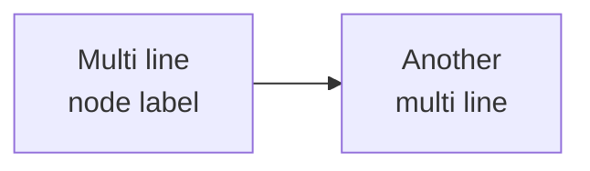
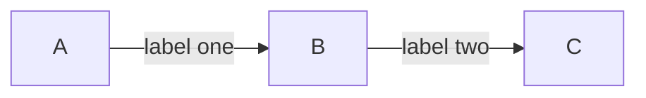

# Mermaid Rendering Test

## Test 1 - Simple graph

## Test 2 - Subgraph

## Test 3 - Sequence diagram (clean)

## Test 4 - Styled nodes

## Test 5 - ER diagram

## Test 6 - Decision diamond

## Test 7 - Labels with br

## Test 8 - Edge labels

