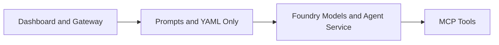
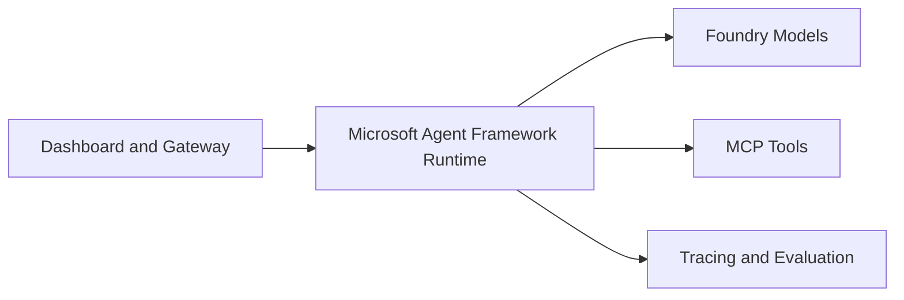
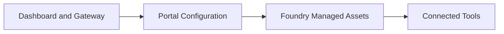
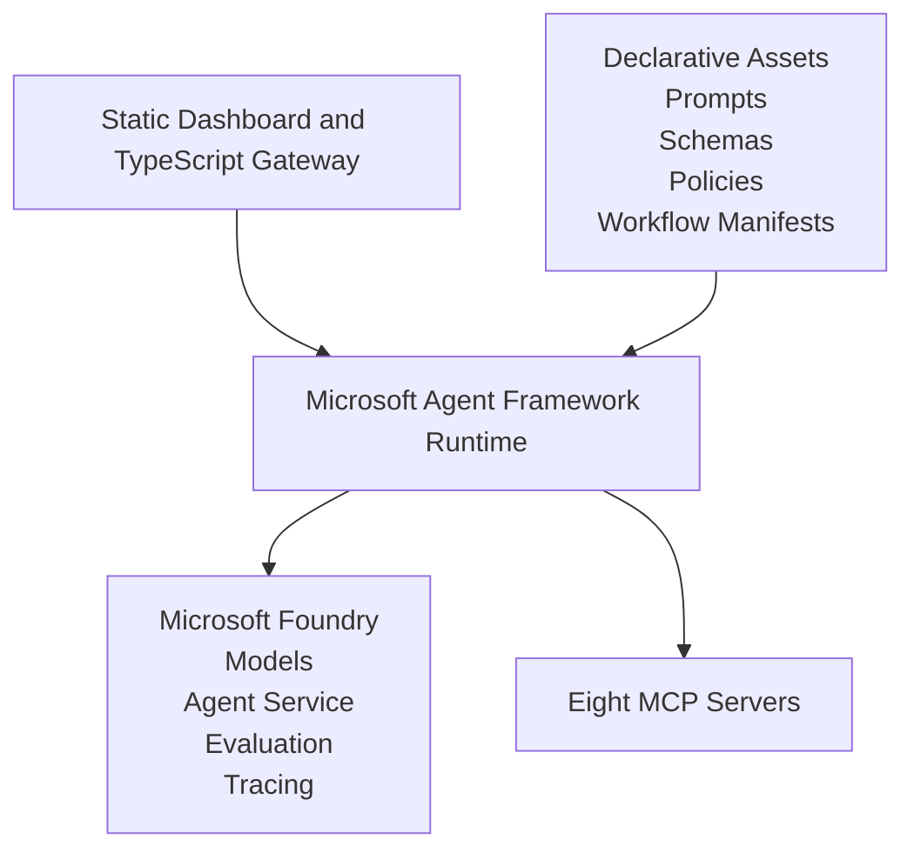
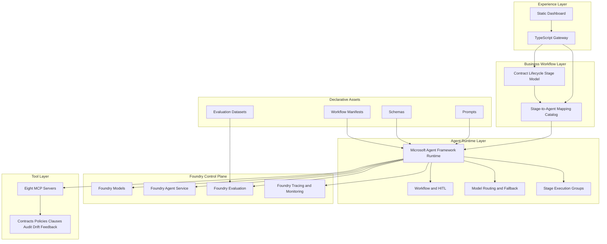

# ADR: Contract AgentOps Demo Architecture

**Decision ID**: ADR-ContractAgentOps
**Decision Title**: Enterprise-ready architecture for Contract AgentOps Demo using Microsoft Foundry and Microsoft Agent Framework
**Epic**: Contract AgentOps Demo
**Status**: Proposed
**Author**: Solution Architect Agent
**Date**: 2026-03-11
**Related PRD**: [PRD-ContractAgentOps-Demo.md](../prd/PRD-ContractAgentOps-Demo.md)
**Related Spec**: [SPEC-ContractAgentOps-Demo.md](../specs/SPEC-ContractAgentOps-Demo.md)
**Related UX**: [UX-ContractAgentOps-Dashboard.md](../ux/UX-ContractAgentOps-Dashboard.md)

---

## 1. Context

The Contract AgentOps Demo needs one clear architecture direction for enterprise discussions. The current repo already has a stable TypeScript gateway, static dashboard under `ui/`, eight MCP servers, a live Foundry deployment path, and an early Microsoft Agent Framework runtime track under `agents/microsoft-framework/`.

The product direction now adds a second requirement beyond runtime standardization: the active demo contract business workflow must remain legible as a six-stage pre-execution lifecycle while also fitting naturally into the AgentOps lifecycle. That means the architecture must preserve two distinct state models:

1. Contract Lifecycle state for business progress across request, drafting, review, compliance, negotiation, and approval.
2. AgentOps state for designing, validating, deploying, observing, evaluating, and improving the agents that implement those business stages.

The architecture therefore must avoid two failure modes: collapsing business stages into AgentOps status, or forcing the contract workflow into a single flat agent chain that cannot represent stage-specific agent groups.

The architectural question is not whether the solution should use AI. The repo exists to demonstrate AgentOps for contract understanding, compliance reasoning, evaluation, drift handling, and human approval. Deterministic rules alone are insufficient for contract interpretation, exception handling, and risk explanation. At the same time, prompt-only orchestration is not sufficient for enterprise governance, recovery, and testability.

### AI-First Assessment

| Question | Assessment |
|----------|------------|
| Could this be solved without GenAI? | Partially, but not well enough for contract reasoning, summarization, exception handling, and policy interpretation. [Confidence: HIGH] |
| Should this be pure GenAI? | No. A pure prompt-only approach weakens governance, observability, fallback behavior, and release control. [Confidence: HIGH] |
| Recommended posture | Use GenAI for contract reasoning, but wrap it in deterministic tool boundaries, evaluation gates, policy retrieval, and human approval checkpoints. [Confidence: HIGH] |

### Research Summary

| Source | Evidence | Architectural Effect |
|--------|----------|----------------------|
| Microsoft Agent Framework documentation and repository | Supports agents, workflows, hosting, tools, middleware, OpenTelemetry, human-in-the-loop, Python and .NET, and migration from Semantic Kernel | Strong fit for enterprise agent runtime standardization. [Confidence: HIGH] |
| Microsoft Foundry documentation | Provides model hosting, Agent Service, tracing, evaluation, monitoring, safety, and governance surfaces | Strong fit for enterprise AI control plane. [Confidence: HIGH] |
| Foundry evaluation guidance | Supports model, agent, and dataset evaluations with AI-assisted quality, NLP, and safety metrics using CSV or JSONL datasets | Evaluation should be a formal release gate, not a smoke check. [Confidence: HIGH] |
| Current product requirements and backlog for the contract lifecycle expansion | Require a six-stage active business workflow with explicit separation from AgentOps and allow each stage to map to one or more specialized agents | Architecture must support stage-to-agent mapping without merging business-state and AgentOps-state models. [Confidence: HIGH] |
| Multi-agent workflow guidance in Microsoft Agent Framework | Supports sequential, conditional, concurrent, HITL, and fan-out or fan-in workflow shapes | A rigid one-agent-per-stage or flat four-agent chain is unnecessarily limiting for contract lifecycle orchestration. [Confidence: HIGH] |

### Constraints

| Constraint | Impact |
|-----------|--------|
| Demo runtime already works with TypeScript gateway plus static UI | Preserve these surfaces instead of rewriting them |
| MCP servers already express clean tool boundaries | Retain MCP as the business tool boundary |
| Simulated mode is required for reliable rehearsals and offline demos | Keep dual-mode execution |
| Enterprise story must be stronger than direct REST calls | Standardize on Microsoft Agent Framework for agent execution |

---

## 2. Decision Summary

| # | Decision | Choice |
|---|----------|--------|
| D1 | AI control plane | Microsoft Foundry for models, tracing, evaluation, and governance |
| D2 | Agent runtime | Microsoft Agent Framework as the primary orchestration and execution runtime |
| D3 | Development model | Hybrid declarative plus code model |
| D4 | Experience layer | Keep static dashboard and TypeScript gateway |
| D5 | Tool boundary | Keep eight MCP servers as bounded business tools |
| D6 | Execution mode | Keep live Foundry mode and simulated mode via adapter pattern |
| D7 | Human review | Approval and exception handling remain first-class workflow checkpoints |
| D8 | Evaluation strategy | Combine deterministic metrics, LLM-as-judge, and Foundry-native evaluation runs |
| D9 | Runtime operating model | Use a mixed runtime: TypeScript control plane plus Python Microsoft Agent Framework executor |
| D10 | Lifecycle model | Preserve separate Contract Lifecycle and AgentOps state models |
| D11 | Business workflow realization | Represent each contract stage as one or more specialized agents packaged and governed through AgentOps |

---

## 3. Options Considered

### Option A: Declarative-Only Agents on Foundry

| Dimension | Assessment |
|-----------|------------|
| Strengths | Fast prompt iteration and lower initial engineering effort |
| Weaknesses | Weak runtime controls, weaker fallback behavior, weaker enterprise testability |
| Enterprise fit | Medium-Low |

### Option B: In-Code Agent Runtime on Microsoft Agent Framework

| Dimension | Assessment |
|-----------|------------|
| Strengths | Strong runtime control, workflow support, tool mediation, HITL, middleware, and tracing |
| Weaknesses | Slower change cycle if prompts and policies are kept only in code |
| Enterprise fit | High |

### Option C: Portal-First or Low-Code Agent Development

| Dimension | Assessment |
|-----------|------------|
| Strengths | Fastest experimentation path |
| Weaknesses | Weaker source control, promotion discipline, and runtime customization |
| Enterprise fit | Medium-Low |

### Option D: Hybrid Declarative Assets plus Microsoft Agent Framework Runtime (Selected)

| Dimension | Assessment |
|-----------|------------|
| Strengths | Best balance of governance, velocity, testing, traceability, and enterprise readiness |
| Weaknesses | More moving parts than prompt-only or portal-only options |
| Enterprise fit | Highest |

**Decision**: Select **Option D**. Use Microsoft Foundry as the enterprise AI control plane and Microsoft Agent Framework as the agent runtime, while keeping prompts, schemas, policy assets, and workflow manifests declarative. [Confidence: HIGH]

### Business Workflow Realization Options

| Option | Summary | Assessment |
|--------|---------|------------|
| R1 | Flat four-agent pipeline for all contracts | Simple, but too coarse for the active six-stage lifecycle and weak at showing how business stages map to runtime responsibilities. [Confidence: HIGH] |
| R2 | Exactly one agent per contract stage | More legible than a flat pipeline, but too rigid for stages that naturally need parallel review, escalation, or sub-specialization. [Confidence: MEDIUM] |
| R3 | Flexible stage-to-agent mapping where each contract stage can map to one or more agents | Best fit for business clarity, AgentOps packaging, and future evolution from simple to multi-agent stages. [Confidence: HIGH] |

**Decision**: Select **R3**. The runtime must support a contract-stage abstraction that is business-facing, while the implementation can package each stage as one or more runtime agents. [Confidence: HIGH]

---

## 4. Target Architecture

### Agent Topology

| Contract Stage | Recommended Runtime Pattern | Primary Outputs | Confidence |
|----------------|-----------------------------|-----------------|------------|
| Request and Initiation | Intake agent plus metadata validation agent | Intake completeness, contract classification, routing seed | [Confidence: HIGH] |
| Authoring and Drafting | Drafting agent plus clause recommendation agent | Draft package, recommended clause set, drafting rationale | [Confidence: MEDIUM] |
| Internal Review | Redline analysis agent plus version-diff agent | Review findings, changed-clause summary, escalation flags | [Confidence: HIGH] |
| Compliance Check | Policy mapping agent plus regulatory review agent | Policy exceptions, compliance risk score, required approvals | [Confidence: HIGH] |
| Negotiation and External Review | Counterparty change analysis agent plus fallback recommendation agent | Negotiation summary, fallback positions, unresolved issues | [Confidence: MEDIUM] |
| Approval Routing | Routing agent plus escalation agent | Approver path, review package, HITL checkpoint state | [Confidence: HIGH] |

The active MVP stops at Approval Routing. Signature, obligations, renewal, and analytics remain future lifecycle extensions rather than default runtime stages.

### Lifecycle Separation Rule

| Concern | Contract Lifecycle | AgentOps |
|---------|--------------------|----------|
| Primary audience | Business and legal users | Engineering, platform, and AI operations users |
| State meaning | Where the agreement is in the business process | How the supporting agents are designed, validated, deployed, and improved |
| Correlation rule | Contract stage may reference one or more runtime agents | Agent package may support one or more contract stages, but does not replace business-stage state |

**Decision**: Contract-stage progress and AgentOps progress must be correlated, but never collapsed into one shared status model. [Confidence: HIGH]

### Development Model

| Layer | Declarative | In Code |
|-------|-------------|---------|
| System prompts | Yes | No |
| Output schemas | Yes | No |
| Workflow manifests | Yes | No |
| Policy thresholds | Yes | No |
| Retry and fallback | No | Yes |
| HITL enforcement | No | Yes |
| Tool authorization | No | Yes |
| Middleware and observability | No | Yes |

### Runtime Operating Model

| Layer | Technology | Responsibility |
|-------|------------|----------------|
| Experience and control plane | TypeScript gateway plus static dashboard | Workflow authoring, validation, activation, operator APIs, deployment view, evaluation controls, and demo coordination |
| Business tool boundary | TypeScript MCP servers | Contract-domain tools, policy lookups, audit helpers, evaluation tools, drift tools, and feedback tools |
| Agent execution plane | Python Microsoft Agent Framework runtime | Multi-agent orchestration, model routing, tool mediation, HITL checkpoints, workflow state, retries, and tracing emission |
| AI control plane | Microsoft Foundry | Models, agent service integration, tracing, evaluation, content safety, and monitoring |

**Decision**: Do not force a Node-only runtime. The best-fit operating model is a mixed runtime where TypeScript remains the product and tool control plane, while Python becomes the primary Microsoft Agent Framework execution plane. [Confidence: HIGH]

---

## 5. Rationale

| Recommendation | Why | Confidence |
|----------------|-----|------------|
| Use Microsoft Foundry for model hosting, tracing, evaluation, and governance | The repo already uses Foundry in live mode and Foundry provides the clearest enterprise control plane story | [Confidence: HIGH] |
| Use Microsoft Agent Framework as the primary agent runtime | It replaces bespoke orchestration with workflow, middleware, tool, and hosting primitives aligned to enterprise agent systems | [Confidence: HIGH] |
| Keep the TypeScript gateway and static dashboard | They already work and form a stable user-facing control plane | [Confidence: HIGH] |
| Keep MCP as the business tool boundary | MCP servers already align with the demo lifecycle and keep agent permissions explicit | [Confidence: HIGH] |
| Keep simulated mode alongside live Foundry mode | Simulated mode protects demo reliability, while live mode remains the enterprise truth path | [Confidence: HIGH] |
| Externalize prompts, schemas, and workflow manifests | This preserves fast change velocity and reviewability without weakening runtime controls | [Confidence: HIGH] |
| Use Python rather than Node.js for the MAF executor | MAF is first-class in Python and .NET, while the repo already has a working TypeScript control plane that should not be rewritten | [Confidence: HIGH] |
| Preserve separate lifecycle state models | Merging business-stage state with AgentOps state would blur user meaning, weaken observability, and make workflow evidence harder to interpret | [Confidence: HIGH] |
| Use flexible stage-to-agent mapping | Some stages remain simple in MVP, while others need concurrent review, escalation, or specialized sub-agents without changing the business-stage model | [Confidence: HIGH] |

### Why This Is the Enterprise Choice

| Enterprise Need | Declarative Only | In-Code Only | Hybrid with Foundry plus MAF |
|-----------------|------------------|--------------|------------------------------|
| Prompt and policy agility | Strong | Weak | Strong |
| Workflow safety and fallback | Weak | Strong | Strong |
| Auditability and promotion discipline | Medium | Strong | Strong |
| Observability | Medium | Strong | Strong |
| Long-term maintainability | Medium | Strong | Strong |

---

## 6. Consequences

### Positive

| Outcome | Effect |
|---------|--------|
| Single architecture story | The repo has one clear recommendation instead of competing orchestration patterns |
| Better enterprise posture | Evaluation, tracing, guardrails, and HITL become first-class, not optional |
| Clear migration path | Existing gateway, UI, MCP servers, datasets, and deployment automation can remain |
| Better governance | Declarative assets remain versioned and reviewable while runtime behavior stays explicit |

### Negative

| Outcome | Effect |
|---------|--------|
| More moving parts than prompt-only designs | Requires explicit runtime plus control-plane boundaries |
| Mixed-language operations | Intentionally keeps TypeScript control-plane code plus a Python agent runtime |
| Preview maturity risk | Agent Framework versions must be pinned and introduced carefully |

---

## 7. Delivery Guidance

| Area | Guidance |
|------|----------|
| Runtime migration | Promote `agents/microsoft-framework/` into the primary orchestration boundary in phases, but keep workflow authoring and activation in the TypeScript gateway |
| Evaluation | Require deterministic regression metrics plus Foundry evaluation runs before promotion |
| Guardrails | Enforce schema validation, tool allowlists, content safety checks, and approval checkpoints |
| Model management | Pin a primary model, a fallback model, and a smaller emergency model in Foundry |
| Evidence | Persist workflow IDs, agent outputs, model versions, review actions, and evaluation results |
| Runtime contract | Treat the gateway as the source of truth for active workflow definitions and the Python MAF executor as the source of truth for in-flight execution state |
| Stage modeling | Publish a declarative stage-to-agent mapping catalog as part of the active workflow package so business stages remain explicit and runtime agent groups remain auditable |

---

## 8. References

### Internal

- [PRD-ContractAgentOps-Demo.md](../prd/PRD-ContractAgentOps-Demo.md)
- [UX-ContractAgentOps-Dashboard.md](../ux/UX-ContractAgentOps-Dashboard.md)
- `agents/microsoft-framework/`

### External

- Microsoft Agent Framework documentation and repository
- Microsoft Foundry documentation
- Foundry evaluation guidance
- Model Context Protocol specification

---

## 9. Review History

| Date | Reviewer | Status | Notes |
|------|----------|--------|-------|
| 2026-03-10 | Solution Architect Agent | Proposed | Consolidated to one canonical architecture document using Microsoft Foundry plus Microsoft Agent Framework |
| 2026-03-11 | Solution Architect Agent | Proposed | Extended the architecture with dual-lifecycle separation and a stage-to-agent realization model for the expanded contract lifecycle |

---

**Generated by AgentX Architect Agent**
**Author**: Solution Architect Agent
**Last Updated**: 2026-03-11
**Version**: 2.1
