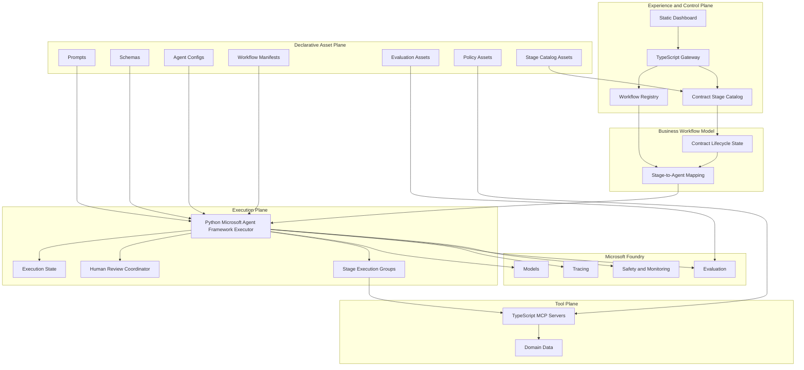

# Technical Specification: Contract AgentOps Demo

**Feature**: Contract AgentOps Demo
**Status**: Draft
**Author**: Solution Architect Agent
**Date**: 2026-03-11
**Related PRD**: [PRD-ContractAgentOps-Demo.md](../prd/PRD-ContractAgentOps-Demo.md)
**Related ADR**: [ADR-ContractAgentOps-Demo.md](../adr/ADR-ContractAgentOps-Demo.md)
**Related UX**: [UX-ContractAgentOps-Dashboard.md](../ux/UX-ContractAgentOps-Dashboard.md)

---

## 1. Overview

This specification defines the engineering baseline for the Contract AgentOps Demo after the architecture consolidation. It resolves three decisions that were still ambiguous in the repository state:

| Topic | Decision | Confidence |
|-------|----------|------------|
| Runtime operating model | Mixed runtime: TypeScript control plane plus Python Microsoft Agent Framework executor | [Confidence: HIGH] |
| Runtime contract | The gateway owns workflow definition, validation, activation, and execution requests; the MAF executor owns orchestration and in-flight workflow state | [Confidence: HIGH] |
| Declarative source of truth | Prompts, schemas, agent configs, workflow manifests, evaluation datasets, and policy assets are repo-local declarative artifacts consumed by the runtime, not inferred from code | [Confidence: HIGH] |
| Lifecycle separation | Contract Lifecycle remains the business-stage model, while AgentOps remains the AI system lifecycle | [Confidence: HIGH] |
| Business workflow realization | Each active contract stage may map to one or more runtime agents without changing the business-stage model | [Confidence: HIGH] |

### Intended Outcome

Engineering should be able to implement the runtime without re-deciding:

| Concern | Outcome |
|---------|---------|
| Where the workflow is authored | Static dashboard through the TypeScript gateway |
| What gets activated | A versioned workflow package |
| What executes the package | Python Microsoft Agent Framework runtime |
| Where tools live | TypeScript MCP servers |
| What Foundry does | Model hosting, tracing, evaluation, safety, and agent-service-aligned control-plane capabilities |

---

## 2. Goals And Non-Goals

### Goals

| ID | Goal |
|----|------|
| G1 | Preserve the working TypeScript UI, gateway, and MCP tool plane |
| G2 | Adopt Microsoft Agent Framework as the real agent execution runtime rather than a mock compatibility layer |
| G3 | Define a stable contract between workflow authoring and workflow execution |
| G4 | Make declarative assets complete and reviewable so prompts, schemas, agent configs, and workflow manifests become source-of-truth artifacts |
| G5 | Support both simulated mode and live Foundry mode without changing product-facing authoring behavior |
| G6 | Keep the demo explainable to enterprise stakeholders and implementable by a small engineering team |
| G7 | Keep contract-stage progress legible for business users while keeping AgentOps state legible for engineering and AI operations users |
| G8 | Support stage-to-agent composition so simple stages can stay single-agent and complex stages can grow into multi-agent execution groups |

### Non-Goals

| ID | Non-Goal |
|----|----------|
| NG1 | Rewriting the existing gateway, UI, and MCP servers into Python |
| NG2 | Making the dashboard a direct MAF host |
| NG3 | Treating workflow authoring JSON from the UI as the final execution payload without canonical normalization |
| NG4 | Introducing a production multi-tenant platform, service mesh, or durable workflow engine beyond what the demo needs |
| NG5 | Replacing MCP with direct tool calls from the MAF executor |
| NG6 | Collapsing Contract Lifecycle state and AgentOps state into one shared status model |
| NG7 | Forcing exactly one runtime agent for every contract business stage regardless of the stage complexity |

---

## 3. Architecture

### Architecture Decision

| Option | Summary | Why Not Selected |
|--------|---------|------------------|
| Node-only runtime | Keep all orchestration in TypeScript | Weakens the MAF story, forces bespoke orchestration, and duplicates work the framework already provides |
| Full Python rewrite | Move gateway, UI control plane, and tools to Python | High migration cost with no demo benefit and unnecessary churn in working surfaces |
| Mixed control plane plus executor | Keep TypeScript operator plane and MCP tools, add Python MAF executor | Best balance of pragmatism, framework alignment, and delivery risk |

---

## 4. Component Design

### 4.1 Static Dashboard

| Responsibility | Description |
|----------------|-------------|
| Workflow authoring | Create, edit, validate, save, load, and activate workflows |
| Operator visibility | Show deployment, live workflow, monitoring, evaluation, drift, and feedback views |
| HITL interaction | Capture approval decisions and review comments |

### 4.1.1 Dashboard Representation Contract

| View Concern | Required Representation |
|--------------|-------------------------|
| Design view | Must represent business stages and their mapped runtime agent groups rather than only a flat four-agent pipeline |
| Live workflow view | Must show contract-stage progression as the primary business narrative and allow drill-down into the underlying agent activity for the active stage |
| Monitor view | Must support trace navigation from contract instance -> contract stage -> stage execution group -> agent step -> tool event |
| Evaluate, drift, and feedback views | Must be able to attribute evidence to both business stages and the underlying agent packages or runtime groups |
| Global navigation and labels | Must keep Contract Lifecycle vocabulary separate from AgentOps vocabulary so users can tell whether they are viewing business progress or AI system state |

### 4.1.2 Presenter Clarity Rules

| Rule | Meaning |
|------|---------|
| Business-first narrative | The presenter should be able to explain where the contract is in the business process before explaining which agents are active |
| Drill-down second | Agent detail, tool detail, and trace detail should appear as secondary inspection layers, not the primary business status display |
| Side-by-side evidence | When both lifecycle views are shown, the UI should align them visually without implying they are the same state machine |

### 4.2 TypeScript Gateway

| Responsibility | Description |
|----------------|-------------|
| Control-plane API | Expose workflow, contract, deploy, audit, evaluation, drift, and feedback APIs |
| Workflow registry | Persist workflow definitions, track active workflow version, and publish runtime-ready workflow packages |
| Contract stage catalog | Publish the active demo business-stage definitions and the stage-to-agent mapping used by the active workflow package |
| Translation boundary | Normalize UI authoring state into a canonical workflow package that the MAF executor consumes |
| Demo coordination | Manage simulated mode, deployment view, and operator status surfaces |

### 4.3 Python MAF Executor

| Responsibility | Description |
|----------------|-------------|
| Orchestration | Execute the active workflow package using MAF workflows and agents |
| Model routing | Select primary, fallback, and emergency models |
| Tool mediation | Invoke MCP servers under explicit tool authorization boundaries |
| HITL checkpoints | Pause, resume, reject, or modify workflow steps based on human decisions |
| Execution state | Track workflow instance, step state, retries, and outputs |
| Stage execution grouping | Materialize each contract stage as one or more runtime agent groups while preserving business-stage identifiers |
| Trace emission | Emit workflow and agent telemetry to Foundry and the gateway-visible audit surfaces |

### 4.4 MCP Servers

| Responsibility | Description |
|----------------|-------------|
| Domain operations | Contract intake, extraction, compliance, workflow, audit, evaluation, drift, and feedback tools |
| Business boundary | Remain the only allowed contract-domain tool interface for the MAF executor |

### 4.5 Contract Stage-To-Agent Mapping

| Contract Stage | Runtime Agent Group | Primary MCP Affinity | MVP Shape | Notes |
|----------------|---------------------|----------------------|-----------|-------|
| Request and Initiation | Intake agent plus metadata validation agent | Intake, workflow | Single group with optional validation branch | Establishes contract type, completeness, and routing context |
| Authoring and Drafting | Drafting agent plus clause recommendation agent | Extraction, workflow | Parallelizable pair | Keeps drafting distinct from clause guidance |
| Internal Review | Redline analysis agent plus version-diff agent | Extraction, audit | Parallelizable pair | Supports faster review of changed clauses and versions |
| Compliance Check | Policy mapping agent plus regulatory review agent | Compliance | Parallelizable pair | Produces policy exceptions and regulatory findings |
| Negotiation and External Review | Counterparty change analysis agent plus fallback recommendation agent | Compliance, workflow | Sequential pair | First understand counterparty changes, then recommend fallback positions |
| Approval Routing | Routing agent plus escalation agent | Workflow, audit | Sequential plus HITL | Finalizes approver path and pauses when material risk exists |

The active MVP intentionally stops at Approval Routing. Signature, obligations, renewal, and analytics remain future lifecycle extensions, but they are not part of the default runtime baseline for this demo.

### 4.6 Lifecycle Separation Contract

| Rule | Meaning |
|------|---------|
| Business-stage state stays contract-centric | The active contract always reports where it is in the contract lifecycle |
| AgentOps state stays runtime-centric | The platform always reports how the implementing agents are designed, validated, deployed, or observed |
| Correlation happens by reference | Stage identifiers, execution-group identifiers, workflow package version, and trace identifiers connect both views |
| No merged status vocabulary | A contract is never labeled only by AgentOps status, and an agent package is never treated as the business-stage status |

---

## 5. Data Model

### 5.1 Runtime Control Objects

| Object | Owner | Purpose |
|--------|-------|---------|
| Workflow Definition | Gateway | Authoring-time representation saved from the dashboard |
| Workflow Package | Gateway | Canonical execution-ready artifact derived from the active workflow definition |
| Workflow Activation | Gateway | Record that binds one workflow package version as active |
| Workflow Execution Request | Gateway | Request to run the active workflow against a contract input |
| Contract Stage Catalog | Gateway | Business-stage definitions, ordering, and stage metadata |
| Stage Mapping Record | Gateway | Declarative mapping from one contract stage to one or more runtime agent groups |
| Workflow Instance | MAF executor | In-flight execution state for a specific contract and workflow package version |
| Stage Execution Group | MAF executor | Runtime realization of one contract stage using one or more coordinated agents |
| Step Result | MAF executor | Per-agent output validated against schemas |
| HITL Decision | Gateway and MAF executor | Review outcome used to continue, reject, or modify execution |
| Evaluation Record | Gateway plus Foundry | Quality result for promotion, demo evidence, and drift baselines |

### 5.2 Required Workflow Package Fields

| Field | Meaning |
|-------|---------|
| Workflow identifier | Stable logical workflow name |
| Workflow version | Immutable activated version |
| Authoring source | Reference to dashboard-saved workflow definition |
| Execution topology | Sequential, parallel, sequential plus HITL, fan-out, or conditional |
| Contract stage map | Ordered business-stage list plus mapping to runtime execution groups |
| Agent roster | Ordered set of runtime agents and roles |
| Tool bindings | Allowed MCP tool references per agent |
| Prompt references | File references to system prompts and optional templates |
| Schema references | File references for input, output, and validation schemas |
| Policy references | File references for contract and compliance policy assets |
| Model policy | Primary, fallback, and emergency model references |
| HITL policy | Checkpoint stages, timeout rules, approver role, and escalation path |
| Mode policy | Simulated or live runtime behavior |

### 5.3 Source-Of-Truth Rule

| Artifact | Source Of Truth |
|----------|-----------------|
| Workflow authoring metadata | Gateway-managed workflow definition |
| Contract-stage definitions and mapping | Gateway-managed stage catalog plus active workflow package |
| Runtime execution shape | Gateway-produced workflow package plus declarative asset references |
| In-flight state | MAF executor |
| Agent prompts | Files under prompts |
| Validation contracts | Files under config or schemas |
| Policy rules | Files under data and policy asset locations |

---

## 6. API Design

### 6.1 Contract Between Gateway And MAF Executor

The runtime contract is intentionally split into three phases.

| Phase | System Of Record | Purpose |
|-------|------------------|---------|
| Author | Gateway | Save and validate workflow definitions from the dashboard |
| Activate | Gateway | Publish one canonical active workflow package version |
| Execute | MAF executor | Run contract instances against the active workflow package |

### 6.2 Gateway Responsibilities In The Contract

| Responsibility | Rule |
|----------------|------|
| Validate authoring state | The gateway blocks activation when structural validation fails |
| Normalize workflow state | The gateway converts UI-specific layout data into a canonical workflow package |
| Version workflow package | Every activation creates an immutable version |
| Publish contract stage map | The gateway exposes the ordered contract stages and their agent-group mappings for the active workflow version |
| Expose active workflow | The gateway exposes the currently active workflow package and version |
| Start execution | The gateway submits contract execution requests against the active workflow package |
| Collect HITL responses | The gateway accepts human decisions and forwards them to the matching workflow instance |

### 6.3 MAF Executor Responsibilities In The Contract

| Responsibility | Rule |
|----------------|------|
| Accept only canonical packages | The executor never runs raw UI authoring state |
| Resolve declarative references | The executor loads prompts, schemas, agent configs, and workflow manifests from approved paths |
| Enforce tool boundaries | The executor invokes only declared MCP tools for each agent |
| Preserve stage identity | The executor records the contract stage identifier alongside runtime execution-group and per-agent identifiers |
| Own workflow instance state | Retries, step status, pause state, and result materialization live in the executor |
| Emit execution evidence | The executor returns execution status, step results, HITL waits, and trace identifiers |

### 6.4 Required Control-Plane Endpoints

| Endpoint Category | Purpose |
|-------------------|---------|
| Workflow registry | Save, list, retrieve, delete, and activate workflow definitions |
| Active workflow package | Retrieve current canonical runtime package and version |
| Execution submission | Start a workflow instance for a contract input |
| Execution status | Query instance status, step state, and trace references |
| HITL decision | Submit approval, rejection, or modification outcomes |

### 6.5 State And Status Semantics

| Status | Meaning | Owner |
|--------|---------|-------|
| Draft | Saved but not active workflow definition | Gateway |
| Active | Workflow package version selected for execution | Gateway |
| Accepted | Executor has accepted a run request | MAF executor |
| Running | Workflow instance is in progress | MAF executor |
| Waiting for review | Workflow instance paused for HITL | MAF executor |
| Completed | Workflow instance finished successfully | MAF executor |
| Failed | Workflow instance ended unsuccessfully | MAF executor |
| Cancelled | Workflow instance was terminated intentionally | MAF executor |

### 6.6 UI State Projection Rules

| Projection | Rule |
|------------|------|
| Contract-stage status | Derived from the stage map and executor evidence, but presented as business-stage progress |
| AgentOps status | Derived from deployment, runtime, monitoring, evaluation, drift, and feedback signals |
| Mixed views | Any view that combines both must show the join key explicitly, such as workflow version, trace identifier, or stage execution group |
| HITL pauses | Must indicate both the paused contract stage and the specific runtime review checkpoint that caused the pause |

---

## 7. Security

| Area | Requirement |
|------|-------------|
| Trust boundaries | The dashboard never calls MCP servers or Foundry directly; all control flows through the gateway and executor |
| Tool authorization | Each agent may invoke only the MCP tools declared in the active workflow package |
| Stage authorization | Stage execution groups may only invoke the agent roles and tools declared for that stage in the active package |
| Secret handling | Foundry credentials remain in environment or vault-backed settings, never in workflow definitions or prompt files |
| Content safety | Foundry safety checks remain enabled for live execution |
| Input validation | Contract inputs, workflow definitions, HITL decisions, and evaluation requests are validated at the gateway boundary |
| Output validation | Step outputs are schema-validated before being published as final results |
| Auditability | Workflow version, model version, tool usage, and reviewer actions must be traceable |

---

## 8. Performance

| Metric | Target | Notes |
|--------|--------|-------|
| Workflow activation visibility | Immediate in UI after activation | Control-plane action only |
| Execution start acknowledgment | Fast operator feedback after submission | Execution may continue asynchronously |
| Per-step latency | Demo-appropriate near-real-time behavior | Avoid long silent waits in presenter flows |
| Stage summary latency | Business-stage progress should update fast enough for presenters to explain transitions without confusion | Business-stage view must not lag far behind agent-step events |
| Activation-to-runtime consistency | No stale workflow package after activation | The executor must always resolve the latest active version before starting a new instance |

### Performance Guidance

| Concern | Guidance |
|---------|----------|
| Workflow package size | Keep packages lightweight and reference declarative files rather than embedding large content |
| Prompt loading | Resolve prompt files by reference and cache safely per workflow version |
| Stage aggregation | Compute business-stage summaries from runtime events without duplicating large execution payloads into the UI layer |
| Evaluation | Keep heavy evaluation workloads off the synchronous user-facing execution path |

---

## 9. Error Handling

| Failure Mode | Expected Behavior |
|--------------|------------------|
| Invalid workflow definition | Gateway rejects save or activation with explicit structural findings |
| Missing declarative asset | Activation fails before the workflow package becomes active |
| Executor cannot resolve active package | Execution request fails fast with a control-plane error |
| MCP tool unavailable | Executor marks the step failed or retries per runtime policy |
| Model failure | Executor follows model fallback policy and records the selected model path |
| HITL timeout | Executor follows escalation policy and records timeout outcome |

### Error Ownership Rule

| Error Class | Owner |
|-------------|-------|
| Authoring and activation errors | Gateway |
| Orchestration and step execution errors | MAF executor |
| Tool implementation errors | MCP server plus executor surface |

---

## 10. Monitoring

| Signal | Owner | Purpose |
|--------|-------|---------|
| Workflow activation events | Gateway | Show which package version is active |
| Workflow execution traces | MAF executor plus Foundry | Explain multi-agent execution and timing |
| Tool call metrics | MAF executor and MCP servers | Show tool latency, success rate, and boundary usage |
| Model usage | Foundry and MAF executor | Show model routing, token use, and fallback |
| HITL events | Gateway and MAF executor | Show review pauses and decisions |
| Evaluation outcomes | Gateway plus Foundry | Support quality gates and drift baselines |

### Monitoring Rule

The trace identifier exposed in the monitor view must connect one contract submission to the workflow package version, contract-stage identifiers, stage execution groups, agent steps, tool usage, and human review actions.

---

## 11. Testing Strategy

| Test Layer | Scope |
|------------|-------|
| Declarative asset validation | Ensure prompts, schemas, agent configs, workflow manifests, and evaluation assets exist and are internally consistent |
| Stage mapping validation | Ensure each contract stage resolves to one or more valid runtime agent groups with valid tool and schema references |
| Gateway control-plane tests | Save, load, validate, activate, and expose active workflow packages |
| Contract tests | Verify the gateway-to-executor runtime contract remains stable |
| Executor orchestration tests | Verify MAF workflow behavior, tool boundaries, retries, HITL, and fallback |
| End-to-end tests | Submit a contract against an active workflow package and verify monitoring and evaluation evidence |
| UX contract tests | Verify the UI-facing data model can render separate Contract Lifecycle and AgentOps projections without ambiguous labels or missing join keys |

### Minimum Contract Tests

| Contract Test | Purpose |
|---------------|---------|
| Workflow package retrieval | Ensure the active package is immutable and complete |
| Stage mapping retrieval | Ensure the active package exposes a complete ordered contract-stage map |
| Execution submission | Ensure the executor accepts only canonical active packages |
| HITL resumption | Ensure paused workflow instances can continue with human decisions |
| Schema validation | Ensure step outputs conform to declared schemas |
| UI projection contract | Ensure the gateway exposes enough stage, trace, and package metadata for the UI to render the dual-lifecycle model correctly |

---

## 12. Migration Plan

### Phase 1: Control-Plane Stabilization

| Goal | Deliverable |
|------|-------------|
| Remove ambiguity about runtime ownership | Gateway remains workflow source of truth and executor boundary is explicit |
| Canonicalize workflow package | UI workflow state is normalized into a versioned runtime package |

### Phase 2: Declarative Asset Completion

| Goal | Deliverable |
|------|-------------|
| Complete asset inventory | All required prompt, schema, agent config, workflow manifest, evaluation, and policy references are defined and owned |
| Eliminate placeholder paths | No active workflow package references nonexistent declarative assets |

### Phase 3: Stage Model Formalization

| Goal | Deliverable |
|------|-------------|
| Make business stages explicit | Contract stage catalog and stage-to-agent mapping are versioned with the workflow package |
| Support growth beyond flat pipelines | Complex stages can expand into multiple agents without changing the business-stage narrative |

### Phase 4: MAF Promotion

| Goal | Deliverable |
|------|-------------|
| Replace mock compatibility layer | Real Python MAF executor owns orchestration |
| Preserve user-facing workflow story | Dashboard and gateway behavior remain stable while runtime implementation changes underneath |

### Phase 5: Evidence-Driven Promotion

| Goal | Deliverable |
|------|-------------|
| Prove runtime readiness | Evaluation, trace, HITL, and fallback evidence is available for demo and engineering validation |

---

## 13. Open Questions

| Question | Owner | Current Recommendation |
|----------|-------|------------------------|
| Should the executor communicate with the gateway synchronously, asynchronously, or both | Engineering | Use synchronous control-plane calls for the demo first, while keeping status retrieval asynchronous-friendly |
| Should workflow packages be stored only in the gateway or also materialized to disk as immutable runtime artifacts | Engineering | Materialize immutable active versions so execution is reproducible |
| Should the executor use direct Foundry model APIs only or also align to Foundry Agent Service registration flows | Architecture and engineering | Keep model inference mandatory and agent-service-aligned registration visible for deployment demonstrations |
| Which stages should remain single-group in MVP and which should be multi-group immediately | Product and architecture | Start with simple grouping for initiation and approval; use parallelizable groups first for drafting, review, compliance, and negotiation |

---

## Declarative Asset Set

### Required Asset Families

| Asset Family | Purpose | Owner | Source Of Truth Rule |
|--------------|---------|-------|----------------------|
| System prompts | Agent instructions and role framing | Prompt authors plus engineering | One prompt file per agent role, versioned in repo |
| Output schemas | Structured validation for agent results | Engineering | One schema family per agent output and shared runtime event |
| Agent configs | Model policy, tool policy, boundary policy, prompt references, and schema references | Engineering | One config per runtime agent role |
| Workflow manifests | Canonical workflow topology and runtime references | Engineering and architecture | One manifest per supported workflow pattern or activated version |
| Stage catalog assets | Contract-stage definitions, ordering, and stage-to-agent mappings | Engineering and architecture | One catalog per supported contract workflow family or activated version |
| Evaluation assets | Ground truth, judge criteria, and baseline metadata | Engineering and demo owner | Required for quality gates and regression comparison |
| Policy assets | Contract policies, clause libraries, and rule thresholds | Domain owner and engineering | Must be declarative and independently reviewable |

### Required Repository Structure

| Location | Required Contents |
|----------|-------------------|
| prompts | Intake, extraction, compliance, approval, and evaluation-related prompt files |
| config/agents | One declarative config per runtime agent role |
| config/workflows | Canonical workflow manifests and normalized package templates |
| config/stages | Contract stage catalogs and stage-to-agent mapping definitions |
| config/schemas | Input, output, workflow package, execution state, and HITL schemas |
| data/policies | Contract policy assets used by compliance and approval flows |
| data or evaluation asset location | Baselines, eval cases, and judge rubric metadata |

### Completion Criteria For The Declarative Asset Set

| Criterion | Meaning |
|-----------|---------|
| No dangling references | Every agent config and workflow manifest resolves to real prompt and schema assets |
| Stage mappings are complete | Every contract stage resolves to at least one valid runtime execution group |
| No inline prompt ownership | Prompts and templates are not embedded as source-of-truth in runtime code |
| No inferred workflow shape | The executor reads explicit manifests or workflow packages, not hardcoded step graphs |
| Asset ownership is clear | Every asset family has one owning layer and review path |

---

## Review History

| Date | Reviewer | Status | Notes |
|------|----------|--------|-------|
| 2026-03-10 | Solution Architect Agent | Draft | Established mixed runtime operating model, gateway-to-executor contract, and complete declarative asset structure |
| 2026-03-11 | Solution Architect Agent | Draft | Added dual-lifecycle separation, formal stage-to-agent mapping, contract-stage catalog requirements, and a dashboard representation contract for UX alignment |
