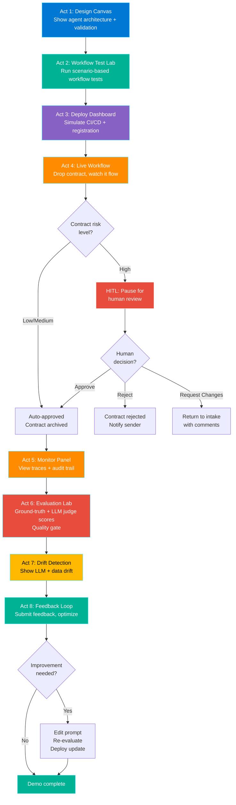
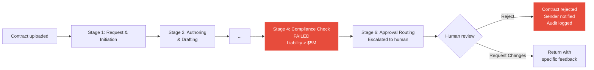
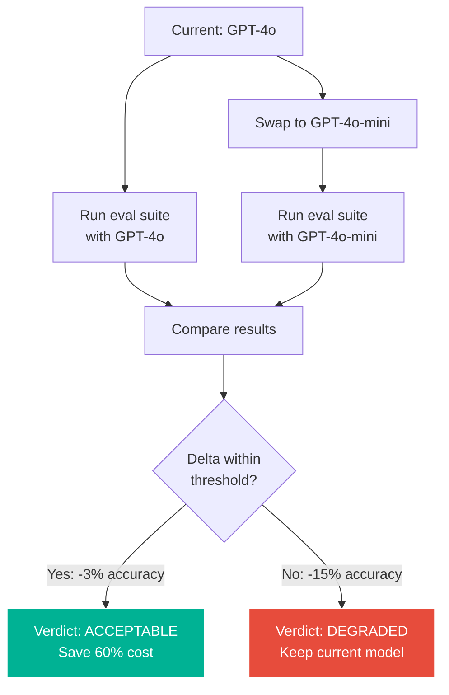
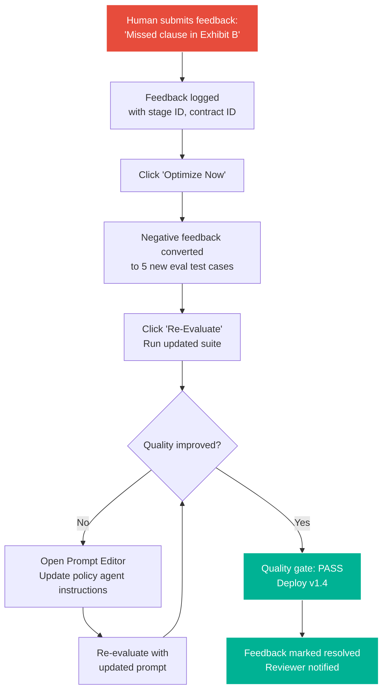

# UX Design: Contract AgentOps Dashboard

> **Architecture Update (2026-03-07)**: The React dashboard has been archived. The primary UI is now a static vanilla HTML/CSS/JS dashboard under `ui/`, served at `http://localhost:8000`. UX patterns described below were implemented in the static UI.

**Feature**: Contract AgentOps Demo Dashboard
**Epic**: Contract AgentOps Demo
**Status**: Draft
**Designer**: UX Designer Agent
**Date**: 2026-03-04
**Related PRD**: [PRD-ContractAgentOps-Demo.md](../prd/PRD-ContractAgentOps-Demo.md)

---

## Table of Contents

1. [Overview](#1-overview)
2. [User Research](#2-user-research)
3. [User Flows](#3-user-flows)
4. [Wireframes](#4-wireframes)
5. [Component Specifications](#5-component-specifications)
6. [Design System](#6-design-system)
7. [Interactions & Animations](#7-interactions--animations)
8. [Accessibility (WCAG 2.1 AA)](#8-accessibility-wcag-21-aa)
9. [Responsive Design](#9-responsive-design)
10. [Interactive Prototypes](#10-interactive-prototypes)
11. [Implementation Notes](#11-implementation-notes)
12. [Open Questions](#12-open-questions)

---

## 1. Overview

### Feature Summary

An 8-view dashboard that visually demonstrates the **dual-lifecycle architecture** of Modern Contract AgentOps. It strictly separates the **Contract Lifecycle** (business workflow) from the **AgentOps Lifecycle** (AI system capabilities). The UX represents a "Contract-Stage-First" paradigm, ensuring these models remain visually distinct but perfectly correlated. The dashboard is optimized for live conference demos on large screens.

### Design Goals

1. **Dual-Lifecycle Separation**: Business state (Contract Lifecycle) is completely distinct from AI system state (AgentOps). They never share a mixed vocabulary.
2. **Business-first narrative**: The primary UI tells the story of where the contract is in the business process.
3. **Drill-down second**: Agent activity, tool details, and tracing form a secondary inspection layer.
4. **Side-by-side evidence**: When both lifecycles are shown, they are aligned visually without implying they are the same state machine.
5. **Dark theme, high contrast**: Optimized for projector/large screen demos with dark background.

### Success Criteria

- Audience understands all 8 AgentOps stages after a 15-20 minute demo
- Each view communicates its stage purpose within 5 seconds of being shown
- Presenter can navigate between views without confusion or dead ends
- All views render correctly on 1920x1080 projector resolution

---

## 2. User Research

### User Personas (from PRD)

**Primary Persona: Demo Presenter (Piyush)**
- **Goals**: Deliver a fluid, impressive demo with minimal clicks
- **Pain Points**: Complex UIs distract from the narrative; too many controls = lost audience
- **Technical Skill**: Advanced
- **Device Preference**: Desktop (projector/large monitor, 1920x1080+)

**Secondary Persona: Technical Decision Maker (Audience)**
- **Goals**: Understand how AgentOps works in practice; evaluate Microsoft Foundry
- **Pain Points**: Bullet points and slides don't convey operational reality
- **Technical Skill**: Intermediate to Advanced

**Tertiary Persona: Developer (Self-Guided)**
- **Goals**: Clone, run, and explore the dashboard independently
- **Pain Points**: No reference implementation to learn from
- **Technical Skill**: Advanced

### User Needs

1. **Presenter needs one-click actions**: "Upload contract", "Run evaluation", "Simulate drift" should each be a single button press
2. **Audience needs visual clarity**: Status changes, data flow, and metrics must be visible from the back of a conference room (large fonts, high contrast, bold colors)
3. **Developer needs code transparency**: The MCP tool calls and agent responses should be inspectable in a console/log panel

---

## 3. User Flows

### 3.1 Primary Flow: End-to-End 8-Act Demo

**Trigger**: Presenter opens the dashboard at the Design Canvas view
**Goal**: Walk through all 8 AgentOps stages with a sample contract
**Preconditions**: All MCP servers running, sample contracts loaded



**Detailed Steps**:

1. **Act 1 -- Design Canvas**
  - **Presenter Action**: Opens dashboard. Sees the 6 active Contract Lifecycle stages. Clicks one (e.g., "Compliance Check") to expand it.
   - **System Response**: Expanding a business stage reveals its mapped "Stage Execution Group" of runtime agents (e.g., Policy Mapping Agent + Regulatory Review Agent).
  - **Talking Point**: "We don't structure our workflow around single agents. We start with the active pre-execution business stages of a contract, then map those stages to specialized groups of AI agents."

2. **Act 2 -- Workflow Test Lab**
  - **Presenter Action**: Clicks "Test" tab. Selects a scenario such as "High-Risk MSA" and clicks "Run Scenario."
  - **System Response**: The view shows expected outcomes, workflow coverage, and pass/warn/fail results with a stage trace.
  - **Talking Point**: "The designer already validates structure. Here we test whether the workflow behaves correctly on realistic contract scenarios."

3. **Act 3 -- Deploy Dashboard**
   - **Presenter Action**: Clicks "Deploy" tab. Clicks "Deploy Pipeline" button.
   - **System Response**: CI/CD stages animate: Build (green) -> Test (green) -> Deploy (green) -> Register (green). Entra Agent IDs appear.
   - **Talking Point**: "We deploy just like code -- CI/CD, and every agent gets an identity."

4. **Act 4 -- Live Workflow**
   - **Presenter Action**: Clicks "Live Workflow" tab. Drags sample NDA PDF onto the drop zone.
   - **System Response**: Primary narrative: Contract progresses through business stages. Stage 1 (Request & Initiation) lights up, processing... Stage 2... Stage 3... Stage 4 (Compliance) pauses. Presenter clicks the active stage to "drill down" and see the underlying agent activity and tool calls animating in real time.
   - **Talking Point**: "Watch the contract flow through our business stages in real time. If we want to see what the AI is doing, we drill down into the active stage."
   - **HITL Moment**: Pipeline pauses in the Approval Routing stage. Presenter clicks "Approve." Pipeline completes.

5. **Act 5 -- Monitor Panel**
   - **Presenter Action**: Clicks "Monitor" tab.
   - **System Response**: Hierarchical trace tree for the NDA appears: Contract Node -> Contract Stage Nodes -> Stage Execution Group (Agents) -> Tool Events.
   - **Talking Point**: "Full observability. We trace from the business stage down to the specific tool call."

6. **Act 6 -- Evaluation Lab**
   - **Presenter Action**: Clicks "Evaluate" tab. Clicks "Run Suite."
  - **System Response**: Progress bar fills. Ground-truth results: 39/57 pass. LLM-as-judge scores appear: relevance 4.1/5, groundedness 4.0/5, coherence 4.4/5. Quality gate: FAIL because the end-to-end pass rate is below release threshold even though judge scores remain acceptable.
  - **Talking Point**: "We don't just deploy -- we evaluate with both deterministic metrics and a judge layer, and we keep the failing baseline visible until the full corpus passes."

7. **Act 7 -- Drift Detection**
   - **Presenter Action**: Clicks "Drift" tab.
   - **System Response**: LLM drift chart shows degradation. Data drift chart shows new clause type. Model swap card compares GPT-4o vs. GPT-4o-mini.
   - **Talking Point**: "LLMs drift. Data changes. We need to detect it -- automatically."

8. **Act 8 -- Feedback Loop**
   - **Presenter Action**: Clicks "Feedback" tab. Submits negative feedback. Clicks "Optimize Now." Edits a prompt. Clicks "Re-Evaluate."
   - **System Response**: Feedback logged. Test cases created. Prompt editor opens. Re-evaluation runs. Metrics improve.
   - **Talking Point**: "Human feedback closes the loop. We improve, re-evaluate, and ship."

### 3.2 Secondary Flow: Contract Rejection

**Trigger**: High-risk contract fails compliance
**Goal**: Show how rejected contracts are handled



### 3.3 Secondary Flow: Model Swap Decision

**Trigger**: Presenter opens Drift Detection and clicks "Simulate Model Swap"
**Goal**: Show cost-quality tradeoff analysis



### 3.4 Secondary Flow: Feedback-to-Improvement Cycle

**Trigger**: Presenter submits negative feedback on a compliance result
**Goal**: Show the full closed-loop improvement cycle



---

## 4. Wireframes

### Global Shell: Navigation + Layout

**Purpose**: Persistent navigation bar across all 8 views
**Context**: Always visible at the top of the dashboard

```
+=============================================================================+
| [C] Contract AgentOps          [Stage Progress Bar: 1 2 3 4 5 6 7 8 ]      |
|                                                                             |
| [Design] [Test] [Deploy] [Live] [Monitor] [Evaluate] [Drift] [Feedback]   |
|  ^active                                                                    |
|=============================================================================|
|                                                                             |
|                      << Active View Content >>                              |
|                                                                             |
|                                                                             |
|                                                                             |
|                                                                             |
|=============================================================================|
| MCP Status: 8/8 [PASS]  |  Model: GPT-4o  |  Contracts: 5 loaded  | v1.0  |
+=============================================================================+
```

**Navigation Design**:
- Horizontal tab bar with 8 tabs, color-coded by stage
- Active tab has a bright underline + bold text
- Stage progress indicator shows completed stages (filled dots)
- Status bar at bottom shows MCP server health, model, and contract count

---

### View 1: Design Canvas

**Purpose**: Visualize the Contract Lifecycle stages and their mapped runtime agents
**AgentOps Stage**: Design

```
+=============================================================================+
| DESIGN CANVAS                                            [Reset Layout]     |
|=============================================================================|
|                                                                             |
| +--- Contract Lifecycle (Business Workflow) ------------------------------+ |
| |                                                                         | |
| | [1. Request] -> [2. Drafting] -> [3. Review] -> [4. Compliance] -> ...  | |
| |                                                   ^ (Active Selection)  | |
| +-------------------------------------------------------------------------+ |
|                                                                             |
| +--- Stage Execution Group (AgentOps Runtime) ----------------------------+ |
| |                                                                         | |
| | Stage 4: Compliance Check                                               | |
| |                                                                         | |
| |  +---------------------+      +---------------------+                   | |
| |  | POLICY MAPPING AGENT|      | REGULATORY REVIEW   |                   | |
| |  | Model: GPT-4o       | ---> | Model: o3-mini      |                   | |
| |  | Tools:              |      | Tools:              |                   | |
| |  |  - check_policy     |      |  - search_regs      |                   | |
| |  |  - get_rules        |      |  - flag_risk        |                   | |
| |  | Boundary:           |      | Boundary:           |                   | |
| |  | Map clauses only    |      | Flag compliance only|                   | |
| |  +---------------------+      +---------------------+                   | |
| +-------------------------------------------------------------------------+ |
|                                                                             |
|  +-----------------------------------------------------------------------+  |
|  | Architecture Inventory                                                |  |
|  | 10 Contract Stages | 14 Specialized Agents | 8 MCP Servers            |  |
|  +-----------------------------------------------------------------------+  |
+=============================================================================+
```

**Interactions**:
- Click a Contract Stage at the top to display its "Stage Execution Group" (agents) below
- Hover over an agent card to see full prompt instructions and tool schemas
- This explicitly enforces the distinction between business stage and agent implementation

---

### View 2: Workflow Test Lab

**Purpose**: Run workflow-level scenario checks after authoring is complete
**AgentOps Stage**: Test

```
+=============================================================================+
| WORKFLOW TEST LAB                        [Clear Results] [Run All] [Run ->] |
|=============================================================================|
|                                                                             |
| Scenario: [v High-Risk MSA              ]                                  |
| Real mode validates workflow readiness and shows scenario expectations.     |
|                                                                             |
| +------------------------------+  +-------------------------------------+ |
| | ACTIVE WORKFLOW              |  | WORKFLOW COVERAGE                   | |
| | 6 agents, 4 stages, 12 tools |  | [PASS] Intake coverage              | |
| | Readiness: Ready             |  | [PASS] Extraction coverage          | |
| +------------------------------+  | [PASS] Human checkpoint fit         | |
|                                   | [WARN] Parallel review fit          | |
| +------------------------------+  +-------------------------------------+ |
| | SCENARIO BRIEF               |                                        |
| | High-risk MSA with liability |  +-------------------------------------+ |
| | cap, auto-renewal, and       |  | LATEST RESULTS                      | |
| | cross-border transfer terms  |  | [WARN] High-Risk MSA:               | |
| | Expected: compliance review, |  | 4 passed, 1 warning, 0 failed       | |
| | escalation, parallel review  |  | Stage trace: Orchestrator ->        | |
| +------------------------------+  | Parallel compliance + approval      | |
|                                   +-------------------------------------+ |
|                                                                             |
+=============================================================================+
```

**Interactions**:
- Scenario selector to choose representative contract cases
- "Run Scenario" checks the active workflow against the selected scenario
- "Run All" executes the full scenario suite for the current workflow
- Results panel shows pass/warn/fail findings and stage trace
- Design-time authoring rules are validated in the Design view, not here

---

### View 3: Deploy Dashboard

**Purpose**: Simulate CI/CD deployment and Agent 365 registration
**AgentOps Stage**: Deploy

```
+=============================================================================+
| DEPLOY DASHBOARD                                    [Deploy Pipeline ->]    |
|=============================================================================|
|                                                                             |
| Deployment Pipeline                                                         |
| +----------+    +----------+    +----------+    +----------+               |
| |  BUILD   | -> |   TEST   | -> |  DEPLOY  | -> | REGISTER |              |
| | [PASS]   |    | [PASS]   |    | [PASS]   |    | [PASS]   |              |
| | 12s      |    | 8s       |    | 15s      |    | 3s       |              |
| +----------+    +----------+    +----------+    +----------+               |
|                                                                             |
| Agent 365 Registration                                                      |
| +-----------------------------------------------------------------------+  |
| | Agent                  | Entra Agent ID           | Status     | Scope|  |
| |------------------------+--------------------------+------------+------|  |
| | Intake/Meta Agent      | agt-7f3a-intake-001      | Registered | SLA  |  |
| | Clause Extractor Agent | agt-7f3a-extract-002     | Registered | SLA  |  |
| | Policy Mapping Agent   | agt-7f3a-comply-003      | Registered | SLA  |  |
| | Reg. Review Agent      | agt-7f3a-comply-004      | Registered | SLA  |  |
| | Approval Routing Agent | agt-7f3a-approve-005     | Registered | SLA  |  |
| +-----------------------------------------------------------------------+  |
|                                                                             |
| Security Policies Applied                                                   |
| +------------------------------------+  +--------------------------------+ |
| | Identity & Access                  |  | Content Safety                 | |
| | [PASS] Entra ID assigned           |  | [PASS] Content filters ON      | |
| | [PASS] RBAC configured             |  | [PASS] XPIA protection ON      | |
| | [PASS] Conditional access applied  |  | [PASS] PII redaction ON        | |
| +------------------------------------+  +--------------------------------+ |
|                                                                             |
| Deployment Summary: 5 agents deployed | 12 tools registered | 0 errors     |
+=============================================================================+
```

**Interactions**:
- "Deploy Pipeline" button triggers an animated sequence (each stage fills green sequentially)
- Agent 365 table rows appear one-by-one as registration completes
- Security policy checkmarks animate in
- If demo is re-run, "Reset" clears all states

---

### View 4: Live Workflow

**Purpose**: See the contract progress through business stages; drill down into agent activity
**AgentOps Stage**: Run

```
+=============================================================================+
| LIVE WORKFLOW                              [Drop Contract Here] [v NDA.pdf] |
|=============================================================================|
|                                                                             |
| +--- Contract Lifecycle --------------------------------------------------+ |
| |                                                                         | |
| |  [1. Request]   [2. Drafting]   [3. Review]   [4. Compliance]           | |
| |    Done (1.2s)    Done (2.1s)     Done (1.8s)   v Active                | |
| |                                                 |                       | |
| +-------------------------------------------------|-----------------------+ |
|                                                   v                         |
| +--- Stage Execution Group: Compliance --------+--------------------------+ |
| |   +-----------------+     +-----------------+                           | |
| |   | POLICY MAPPING  | --> | REG. REVIEW     |                           | |
| |   |                 |     |                 |                           | |
| |   | Mapping...      |     | Waiting         |                           | |
| |   | [====    ]      |     | [      ]        |                           | |
| |   +------|----------+     +-----------------+                           | |
| |          v                                                              | |
| |        - check_policy_db (Active)                                       | |
| |        - match_clauses (Pending)                                        | |
| +-------------------------------------------------------------------------+ |
|                                                                             |
|  +-----------------------------------------------------------------------+  |
|  | Contract Details                                                      |  |
|  | Type: NDA | Parties: Acme Corp, Beta Inc | Pages: 4 | Risk: --       |  |
|  +-----------------------------------------------------------------------+  |
+=============================================================================+
```

**State: After processing reaches Stage 6: Approval Routing -- HITL pause**:

```
+=============================================================================+
| LIVE WORKFLOW                                          [Contract: NDA.pdf]  |
|=============================================================================|
|                                                                             |
| +--- Contract Lifecycle --------------------------------------------------+ |
| |                                                                         | |
| |  [...]   [4. Compliance]   [5. Negotiation]   [6. Approval Routing]     | |
| |            WARN (2 flags)    Done (0.8s)        [!] HITL Pause          | |
| |                                                                         | |
| +-------------------------------------------------------------------------+ |
|                                                                             |
|  +-----------------------------------------------------------------------+  |
|  | Stage 6: HUMAN REVIEW REQUIRED                               [HIGH]   |  |
|  |-----------------------------------------------------------------------|  |
|  | Reason: Liability cap exceeds $1M policy threshold                    |  |
|  |                                                                       |  |
|  | Flagged Clauses (from Stage 4: Compliance Check):                     |  |
|  |   [!] Section 5.2: Liability cap = $2.5M (Policy max: $1M)           |  |
|  |   [!] Section 8.1: No termination for convenience clause             |  |
|  |                                                                       |  |
|  |  [Approve]   [Reject]   [Request Changes]                            |  |
|  |                                                                       |  |
|  |  Comment: [_____________________________________________]             |  |
|  +-----------------------------------------------------------------------+  |
+=============================================================================+
```

**Interactions**:
- Drag-and-drop contract PDF onto drop zone (or select from dropdown)
- Primary visual focuses on Contract Stages moving left to right
- Drill-down pane reveals the active Stage's *AgentOps* state showing running agents and tools
- HITL panel slides up when Stage 6 encounters a routing escalation
- Approve/Reject/Request Changes buttons resolve the pause

---

### View 5: Monitor Panel

**Purpose**: Full observability -- traces, latency, decision audit trail
**AgentOps Stage**: Monitor

```
+=============================================================================+
| MONITOR PANEL                                [Contract: v NDA.pdf] [Refresh]|
|=============================================================================|
|                                                                             |
| +------ Trace Tree --------------------+  +---------- Latency Breakdown ----------+  |
| |                                      |  |                                        |  |
| | [-] Instance: NDA.pdf (5.8s)         |  |  S1: Request   [====      ] 1.2s       |  |
| |   [-] S1: Request & Initiation (1.2s)|  |  S2: Drafting  [=============] 2.8s    |  |
| |     [-] Group: Intake/Meta Agents    |  |  S4: Compliance[=======    ] 1.5s      |  |
| |       [-] Request Triage Agent (1.2s)|  |  S6: Approval  [=  ] 0.3s (+ human)    |  |
| |         - classify_doc (0.4s) [PASS] |  |  Total: 5.8s (agent) + 45s (human)     |  |
| |         - extract_meta (0.8s) [PASS] |  +----------------------------------------+  |
| |   [-] S2: Authoring & Drafting (2.8s)|                                              |
| |     [-] Group: Drafting Agents       |  +---------- Token Usage -----------------+  |
| |       [-] Clause Extractor Agt (2.8s)|  |  Stage Group  | In    | Out   | Cost |  |
| |         - extract_clauses            |  |  S1: Request   | 1,204 |   342 | $0.01|  |
| |           1.9s [PASS]                |  |  S2: Drafting  | 3,891 | 1,205 | $0.03|  |
| |         - identify_parties           |  |  S4: Compliance| 2,156 |   678 | $0.02|  |
| |           0.5s [PASS]                |  |  S6: Approval  |   456 |   123 | $0.00|  |
| |   [-] S4: Compliance Check (1.5s)    |  |  Total         | 7,707 | 2,348 | $0.06|  |
| |     [-] Group: Policy Agents         |  +----------------------------------------+  |
| |       [-] Policy Mapping Agent       |                                              |
| |         - check_policy               |                                              |
| |           0.8s [WARN]                |                                              |
| |       [-] Reg. Review Agent          |                                              |
| |         - flag_risk                  |                                              |
| |           0.7s [WARN]                |                                              |
| |   [-] S6: Approval Routing (0.3s)    |                                              |
| |       ...                            |                                              |
| +--------------------------------------+                                              |
|                                                                             |
| +-----------------------------------------------------------------------+  |
| | Decision Audit Trail (Business Context)                                |  |
| |------------------------------------------------------------------------|  |
| | Time     | Stage          | Decision               | Reasoning             |  |
| | 10:04:01 | S1: Request    | Classified as NDA      | 97% conf, keyword     |  |
| |          |                |                        | match "Non-Disclosure"|  |
| | 10:04:04 | S2: Drafting   | Extracted 6 clauses    | Structured output     |  |
| |          |                |                        | from sections 1-8     |  |
| | 10:04:06 | S4: Compliance | Flagged Section 5.2    | Liability $2.5M >     |  |
| |          |                |                        | policy max $1M        |  |
| | 10:04:07 | S6: Approval   | Escalated to human     | Risk level: HIGH      |  |
| | 10:04:52 | Human          | Approved               | "Acceptable partner"  |  |
| +-----------------------------------------------------------------------+  |
+=============================================================================+
```

**Interactions**:
- Trace tree: click to expand/collapse Contract Instance -> Contract Stage -> Stage Execution Group -> Agent -> Tool Events
- Click an event to see full input/output JSON in a side panel
- Latency bars and billing align to the Contract Stages for business relevance
- Decision audit trail surfaces events within their Contract Stage context

---

### View 6: Evaluation Lab

**Purpose**: Run eval suites, compare baselines, quality gate pass/fail
**AgentOps Stage**: Evaluate

Current-state note: the values below reflect the latest stored 57-case evaluation baseline from `data/evaluations.json`, not the earlier legacy 20-case run.

```
+=============================================================================+
| EVALUATION LAB                                             [Run Suite ->]   |
|=============================================================================|
|                                                                             |
| +--- Test Suite Config ---+  +------------ Results -----------------------+|
| |                         |  |                                             ||
| | Test Set: 57 contracts  |  | Overall: 39/57 passed (68.4%)              ||
| | Coverage: 95%           |  |                                             ||
| | Last Run: 2 min ago     |  | +--- Ground-Truth Metrics ---------------+ ||
| |                         |  | | Metric       | Score  | Threshold | St  | ||
| | Baseline: corpus=57     |  | | Extraction   | 87.5%  | 85%       |PASS | ||
| | Current:  v1.3          |  | | Compliance   | 87.5%  | 80%       |PASS | ||
| |                         |  | | Classification| 91.5% | 90%       |PASS | ||
| | +-------------------+   |  | | False Flags  |  9.9%  | <15%      |PASS | ||
| | |  Quality Gate     |   |  | | Latency P95  |  2.3s  | <5s       |PASS | ||
| | |  [FAIL] BLOCKED   |   |  | +-------------------------------------------+||
| | |  FULL-CORPUS GATE |   |  |                                             ||
| | +-------------------+   |  | +--- LLM-as-Judge Scores (GPT-4o) -------+ ||
| |                         |  | | Dimension    | Score  | Threshold | St  | ||
| +-------------------------+  | | Relevance    | 4.1/5  | >=4.0     |PASS | ||
|                               | | Groundedness | 4.0/5  | >=3.8     |PASS | ||
|                               | | Coherence    | 4.4/5  | >=4.0     |PASS | ||
|                               | +-------------------------------------------+||
|                               |                                             ||
|                               | +--- Gate Interpretation ----------------+ ||
|                               | | Judge thresholds pass, but end-to-end  | ||
|                               | | corpus accuracy is below 80%, so the   | ||
|                               | | release gate remains blocked.          | ||
|                               | +-------------------------------------------+||
|                               +---------------------------------------------+|
|                                                                             |
| +-----------------------------------------------------------------------+  |
| | Per-Contract Results (click to drill in)                               |  |
| |------------------------------------------------------------------------|  |
| | Contract     | Classification | Extraction | Compliance | Judge Avg | Overall |
| | NDA-001      | [PASS]         | [PASS]     | [PASS]     | 5.0/5     | [PASS]  |
| | MSA-002      | [PASS]         | [FAIL]     | [FAIL]     | 4.5/5     | [FAIL]  |
| | SOW-003      | [FAIL]         | [FAIL]     | [PASS]     | 4.3/5     | [FAIL]  |
| | SAAS-003     | [PASS]         | [FAIL]     | [PASS]     | 4.8/5     | [FAIL]  |
| | ...53 more                                                             |  |
| +-----------------------------------------------------------------------+  |
+=============================================================================+
```

**Interactions**:
- "Run Suite" triggers evaluation with animated progress bar
- Ground-truth metric cards animate in with color-coded status
- LLM-as-judge score cards animate in after ground-truth metrics (staggered 100ms)
- Judge scores display as circular progress (0-5 scale) with color: green >=4.0, yellow >=3.0, red <3.0
- Quality gate card pulses green (PASS) or red (FAIL) -- requires BOTH deterministic thresholds AND judge minimums
- Click any contract row to drill into full extraction vs. ground truth comparison plus per-dimension judge scores
- Baseline comparison shows green/red deltas for both metric types

---

### View 7: Drift Detection Center

**Purpose**: Visualize LLM drift, data drift, and model swap impact
**AgentOps Stage**: Detect

Current-state note: the values below reflect the latest stored drift artifact from `data/drift.json`.

```
+=============================================================================+
| DRIFT DETECTION CENTER                        [Time Range: v Last 30 days]  |
|=============================================================================|
|                                                                             |
| +--- LLM Drift ---------------------------+  +--- Data Drift ------------+|
| |                                          |  |                            ||
| | Extraction Accuracy Over Time            |  | Contract Type Distribution ||
| |                                          |  |                            ||
| |  92% *                                   |  | NDA  [======      ] 30%    ||
| |       \                                  |  | MSA  [=====       ] 22%    ||
| |  88%   *                                 |  | SOW  [===         ] 14%    ||
| |         \                                |  | NEW: AI Services           ||
| |  84%     *                               |  |      [===         ] 15%   ||
| |           \                              |  |                            ||
| |  81%       *  <-- [!] DRIFT DETECTED     |  | [!] SHIFT DETECTED         ||
| |  ....threshold: 85%....                  |  | New contract type appears  ||
| |                                          |  | in 15% of recent contracts ||
| |  Wk1    Wk2    Wk3    Wk4               |  | Not in training set        ||
| +------------------------------------------+  +----------------------------+|
|                                                                             |
| +--- Model Swap Analysis --------------------------------------------------+|
| |                                     [Simulate Swap ->]                    ||
| | +--------------------+   +--------------------+   +-------------------+  ||
| | | Current: GPT-4o    |   | Candidate:         |   | VERDICT           |  ||
| | | Accuracy:  91.2%   |   | GPT-4o-mini        |   |                   |  ||
| | | Latency:   2.3s    |   | Accuracy:  88.1%   |   | ACCEPTABLE        |  ||
| | | Cost/1K:   $0.06   |   | Latency:   1.1s    |   | Accuracy: -3.1%   |  ||
| | |                    |   | Cost/1K:   $0.024   |   | Cost:     -60%    |  ||
| | +--------------------+   +--------------------+   | Latency:  -52%    |  ||
| |                                                    +-------------------+  ||
| +---------------------------------------------------------------------------+|
|                                                                             |
| +--- Recommended Actions --------------------------------------------------+|
| | 1. [!] Expand policy and evaluation coverage for AI Services contracts   ||
| | 2. [!] Retrain extraction prompts on new contract types                  ||
| | 3. [i] Consider GPT-4o-mini swap for non-critical extractions            ||
| | 4. [i] Schedule weekly drift monitoring alerts                           ||
| +---------------------------------------------------------------------------+|
+=============================================================================+
```

**Interactions**:
- LLM Drift: animated line chart that draws over time; threshold line is dashed red
- Data Drift: bar chart with the new type highlighted in orange pulse
- "Simulate Swap" button: runs both models and populates comparison cards with animation
- Verdict card: green border (ACCEPTABLE) or red border (DEGRADED)
- Recommended Actions: clickable items that link to relevant views (e.g., #1 links to Feedback view)

---

### View 8: Feedback & Optimize Loop

**Purpose**: Collect feedback, convert to test cases, optimize prompts, close the loop
**AgentOps Stage**: Feedback

```
+=============================================================================+
| FEEDBACK & OPTIMIZE                                                         |
|=============================================================================|
|                                                                             |
| +--- Recent Feedback -------+  +--- Feedback Trends --------+             |
| |                            |  |                             |             |
| | [!] NDA-017                |  | Stage Performance (30d)     |             |
| |   "Missed termination      |  |                             |             |
| |    clause in Exhibit B"    |  | S1: Request  [PASS] 95%    |             |
| |   -- Jane, Mar 3           |  | S2: Drafting [PASS] 91%    |             |
| |                            |  | S4: Compl.   [WARN] 73%    |             |
| | [+] MSA-022                |  | S6: Approval [PASS] 95%    |             |
| |   "Correct extraction,     |  |                             |             |
| |    good summary"           |  | This Week: 45 reviews      |             |
| |   -- Mike, Mar 3           |  | Positive: 78% (+3%)        |             |
| |                            |  | Top Issue: False flags      |             |
| | [!] NDA-019                |  |  (S4 Policy Agents)         |             |
| |   "False flag on standard  |  |                             |             |
| |    NDA clause"             |  +-----------------------------+             |
| |   -- Sarah, Mar 2          |                                              |
| |                            |                                              |
| | [Submit New Feedback]      |                                              |
| +----------------------------+                                              |
|                                                                             |
| +--- Improvement Cycle ----------------------------------------------------+|
| |                                                                           ||
| | Step 1: Convert Feedback        Step 2: Update Prompt                     ||
| | +-------------------------+     +------------------------------------+    ||
| | | 5 negative feedbacks    |     | Prompt Editor: S4 Policy Agents    |    ||
| | | ready to convert        |     |                                    |    ||
| | |                         |     | "When reviewing contracts, you     |    ||
| | | [Optimize Now ->]       |     |  MUST check all exhibits and       |    ||
| | | Creates new eval test   |     |  appendices for clauses, not just  |    ||
| | | cases automatically     |     |  the main body. Pay special        |    ||
| | +-------------------------+     |  attention to Exhibit B which      |    ||
| |         |                       |  often contains liability and      |    ||
| |         v                       |  termination provisions."          |    ||
| | Step 3: Re-Evaluate            |                                    |    ||
| | +-------------------------+     | [Save Prompt]                      |    ||
| | | [Re-Evaluate ->]        |     +------------------------------------+    ||
| | |                         |                                               ||
| | | Before:  68.4% (39/57)  |     Step 4: Deploy                           ||
| | | After:   pending rerun  |     +------------------------------------+    ||
| | | Delta:   TBD            |     | Version: v1.3 -> next candidate     |    ||
| | |                         |     | Changes: Exhibit scanning added    |    ||
| | | Quality Gate: [FAIL]    |     |                                    |    ||
| | +-------------------------+     | [Deploy v1.4 ->]                   |    ||
| |                                 +------------------------------------+    ||
| +---------------------------------------------------------------------------+|
+=============================================================================+
```

**Interactions**:
- Submit Feedback: modal with thumbs up/down, comment, stage selector, contract selector
- "Optimize Now": converts negative feedback into numbered eval test cases (animated list)
- Prompt Editor: live text editor for S4 policy agent instructions (syntax highlighted markdown)
- "Re-Evaluate": runs eval suite, shows before/after metrics with animated delta
- "Deploy v1.4": triggers deployment pipeline (links to Deploy Dashboard view, brief animation)
- Feedback resolution: once deployed, feedback entries marked as "Resolved in v1.4"

---

## 5. Component Specifications

### 5.1 Agent Card

**Purpose**: Display agent identity, model, tools, and boundaries
**Used in**: Design Canvas, Live Workflow, Monitor Panel

**States**:
- **Idle**: Dark card, subtle border
- **Processing**: Blue glow, progress bar filling, tool calls expanding below
- **Complete**: Green border + checkmark
- **Warning**: Yellow border + exclamation
- **Failed**: Red border + X mark
- **HITL**: Orange pulsing border + "Awaiting Human" badge

**Specifications**:
```
+--------------------+
| [Icon] AGENT NAME  |   <- Bold, 16px, agent color
| Model: GPT-4o      |   <- 12px, gray
| ---------------    |
| Tools:              |   <- 12px, white
|  - tool_name_1      |   <- 12px, light gray, monospace
|  - tool_name_2      |
| ---------------    |
| Boundary:           |   <- 12px, yellow
| Description text    |   <- 11px, gray
+--------------------+
Size: 240px x 280px (desktop)
Background: #2D2D2D
Border: 2px solid {agent_color}
Border-radius: 12px
```

### 5.2 Traffic Light Indicator

**Purpose**: Show status at a glance (pass/warn/fail)
**Used in**: Compliance view, Evaluation Lab, Quality Gates

**Variants**:
- **PASS**: `#00B294` (teal green) + checkmark icon
- **WARN**: `#FFB900` (gold) + exclamation icon
- **FAIL**: `#E74C3C` (red) + X icon
- **INFO**: `#0078D4` (blue) + info icon

**Specifications**:
```css
.status-indicator {
    display: inline-flex;
    align-items: center;
    gap: 6px;
    padding: 4px 12px;
    border-radius: 4px;
    font-size: 12px;
    font-weight: 600;
    text-transform: uppercase;
}
```

### 5.3 Metric Card

**Purpose**: Display a single KPI with trend
**Used in**: Evaluation Lab, Drift Detection, Feedback Trends

**Specifications**:
```
+----------------------------+
|  Extraction Accuracy       |   <- 12px, gray label
|  91.2%                     |   <- 28px, bold, white
|  +3.1% [^]                |   <- 14px, green (positive) / red (negative)
|  Threshold: 85%            |   <- 11px, dim gray
+----------------------------+
Size: 200px x 120px
Background: #2D2D2D
Border-left: 4px solid {metric_color}
```

### 5.4 Trace Tree Node

**Purpose**: Expandable tree showing agent -> tool call hierarchy
**Used in**: Monitor Panel

**Specifications**:
```
[-] Agent Name (1.2s)        <- Collapsible, bold, agent color
    - tool_name_1            <- Indented, monospace
      0.4s [PASS]            <- Latency + status badge
    - tool_name_2
      0.8s [WARN]
```

### 5.5 HITL Review Panel

**Purpose**: Human review interface for escalated contracts
**Used in**: Live Workflow

**Specifications**:
```
Background: #2D2D2D
Border: 2px solid #E74C3C (pulsing)
Contains: Risk level badge, flagged clauses list, extracted summary,
          action buttons (Approve/Reject/Request Changes), comment field
Animation: Slides up from bottom with 300ms ease-out
```

### 5.6 Quality Gate Card

**Purpose**: Binary pass/fail deployment decision -- requires BOTH deterministic thresholds AND judge minimums
**Used in**: Evaluation Lab

**States**:
- **PASS**: Green background (#00B294), large checkmark, "READY TO DEPLOY"
- **FAIL**: Red background (#E74C3C), large X, "BLOCKED" with failing criteria listed

### 5.7 Drift Chart

**Purpose**: Time-series visualization of accuracy degradation
**Used in**: Drift Detection Center

**Specifications**:
- Line chart (Recharts `<LineChart>`)
- X-axis: Time (weeks)
- Y-axis: Accuracy %
- Threshold line: dashed red at 85%
- Data points: circles with hover tooltips
- Alert annotation at the crossing point

### 5.8 Judge Score Card

**Purpose**: Display a single LLM-as-judge dimension score (0-5 scale)
**Used in**: Evaluation Lab

**Specifications**:
```
+----------------------------+
|  Relevance                 |   <- 12px, gray label
|  [=====/=====] 4.6 / 5    |   <- circular progress arc + 28px bold score
|  Threshold: >=4.0  [PASS]  |   <- 11px, dim gray + status badge
+----------------------------+
Size: 200px x 140px
Background: #2D2D2D
Border-left: 4px solid #50E6FF (judge accent)
```

**Color Rules**:
- Score >= 4.0: Teal green arc + PASS badge
- Score >= 3.0: Gold arc + WARN badge
- Score < 3.0: Red arc + FAIL badge

---

## 6. Design System

### 6.1 Layout & Grid

- **Grid System**: CSS Grid + Flexbox (not 12-column -- this is a dashboard, not a content site)
- **Dashboard Max Width**: Full viewport (no max-width -- demo fills the screen)
- **Spacing Base**: 8px grid
- **View padding**: 24px

### 6.2 Typography

**Font Family**:
- Primary: `'Inter', -apple-system, BlinkMacSystemFont, 'Segoe UI', sans-serif`
- Monospace: `'JetBrains Mono', 'Fira Code', 'Courier New', monospace`

**Scale** (optimized for projector visibility):
- **View Title**: 28px / 700 weight / white
- **Section Header**: 20px / 600 weight / white
- **Card Title**: 16px / 600 weight / agent color
- **Body**: 14px / 400 weight / light gray (#F2F2F2)
- **Label**: 12px / 500 weight / mid gray (#606060)
- **Code/JSON**: 13px / 400 weight / monospace / light gray
- **Metric Value**: 28px / 700 weight / white
- **Metric Delta**: 14px / 600 weight / green or red

### 6.3 Color Palette (Dark Theme)

**Backgrounds**:
- Page Background: `#1B1B1B` (near-black)
- Card/Panel Background: `#2D2D2D` (charcoal)
- Elevated Surface: `#383838` (dark gray)
- Input Background: `#1E1E1E`

**Stage Execution Group Colors** (consistent across all views):
- S1: Request (Intake/Meta Agents): `#0078D4` (Microsoft Blue)
- S2: Drafting (Drafting Agents): `#00B294` (Teal Green)
- S4: Compliance (Policy Agents): `#8861C4` (Purple)
- S6: Approval (Routing Agents): `#FF8C00` (Orange)

**Status Colors**:
- Pass/Success: `#00B294` (Teal Green)
- Warning: `#FFB900` (Gold)
- Fail/Error: `#E74C3C` (Red)
- Info: `#0078D4` (Blue)
- HITL/Escalation: `#FF8C00` (Orange)

**Text Colors**:
- Primary: `#FFFFFF` (white) -- titles, values
- Secondary: `#F2F2F2` (light gray) -- body text
- Tertiary: `#A0A0A0` (mid gray) -- labels, captions
- Disabled: `#606060` (dark gray)

**Accent**:
- Accent Line: `#50E6FF` (cyan) -- borders, highlights, active tab underline
- Link: `#50E6FF`

### 6.4 Spacing System

**Base Unit**: 8px

| Token | Value | Usage |
|-------|-------|-------|
| `--space-xs` | 4px | Inline spacing, icon gaps |
| `--space-sm` | 8px | Compact padding |
| `--space-md` | 16px | Card padding, section gaps |
| `--space-lg` | 24px | View padding, major sections |
| `--space-xl` | 32px | Section separators |
| `--space-xxl` | 48px | View-level spacing |

### 6.5 Elevation

- **Level 0**: Flat (page background)
- **Level 1**: `box-shadow: 0 1px 4px rgba(0,0,0,0.4)` -- cards, panels
- **Level 2**: `box-shadow: 0 4px 12px rgba(0,0,0,0.5)` -- modals, dropdowns
- **Level 3**: `box-shadow: 0 8px 24px rgba(0,0,0,0.6)` -- HITL review panel

### 6.6 Border Radius

- **Small**: 4px (buttons, inputs, badges)
- **Medium**: 8px (metric cards, panels)
- **Large**: 12px (agent cards, major sections)

---

## 7. Interactions & Animations

### 7.1 Agent Processing Animation

**Context**: Live Workflow -- agent node transitions
**Sequence**:
1. Node border transitions from gray to agent color (200ms ease)
2. Internal progress bar fills left-to-right (duration = actual processing time)
3. Tool call sub-nodes expand below with slide-down (150ms per tool)
4. On completion: border color changes to status color + icon appears (scale-in 200ms)

### 7.2 Pipeline Flow Animation

**Context**: Live Workflow -- data flowing between agents
**Sequence**:
1. Connection line between completed agent and next agent pulses cyan
2. Animated dot travels along the connection line (400ms)
3. Next agent node activates (border glow begins)

### 7.3 HITL Escalation Animation

**Context**: Live Workflow -- when approval routing agent escalates
**Sequence**:
1. S6 Approval node border turns orange with pulse animation
2. Review panel slides up from bottom (300ms ease-out)
3. "AWAITING HUMAN REVIEW" badge appears with fade-in
4. Background dims slightly to focus attention on the review panel

### 7.4 Quality Gate Animation

**Context**: Evaluation Lab -- after suite completes
**Sequence**:
1. Progress bar fills to 100%
2. Ground-truth metric cards flip in one-by-one (stagger 100ms each)
3. LLM-as-judge score cards animate in with circular arc fill (stagger 100ms, after ground-truth)
4. Quality gate card scales in from center (300ms spring animation)
5. If PASS (all deterministic AND judge thresholds met): green pulse radiates outward. If FAIL: red shake.

### 7.5 Drift Alert Animation

**Context**: Drift Detection -- when threshold is crossed
**Sequence**:
1. Line chart draws progressively (data point by data point, 200ms each)
2. When line crosses threshold: red flash at intersection point
3. "DRIFT DETECTED" badge slides in from right (300ms)
4. Recommended actions list fades in below

### 7.6 Feedback-to-Improvement Animation

**Context**: Feedback view -- optimize cycle
**Sequence**:
1. "Optimize Now" click: negative feedbacks visually transform into test case cards (morph animation, 400ms)
2. "Re-Evaluate" click: before metrics dim, progress bar runs, after metrics appear side-by-side
3. Delta arrows animate (green up / red down with number counting animation)
4. Quality gate resolves (same as 7.4)

### 7.7 Tab Navigation

**Transition**: Cross-fade between views (200ms)
**Active indicator**: Underline slides to new tab position (300ms spring)
**Stage progress dots**: Fill animation when a stage is completed

### 7.8 Reduced Motion

All animations respect `prefers-reduced-motion`:
```css
@media (prefers-reduced-motion: reduce) {
    *, *::before, *::after {
        animation-duration: 0.01ms !important;
        transition-duration: 0.01ms !important;
    }
}
```

---

## 8. Accessibility (WCAG 2.1 AA)

### 8.1 Keyboard Navigation

- **Tab order**: Follows visual layout (top-to-bottom, left-to-right within each view)
- **Tab bar**: Arrow keys navigate between tabs, Enter/Space activates
- **Agent cards**: Tab to focus, Enter to expand details
- **Action buttons**: Full keyboard support (Enter to confirm, Escape to cancel)
- **Trace tree**: Arrow keys to navigate, Enter to expand/collapse nodes
- **Focus indicator**: 2px solid `#50E6FF` outline on all focusable elements

### 8.2 Screen Readers

- All views have `<main>` landmark with `aria-label="[View Name]"`
- Agent status changes announced via `aria-live="polite"` regions
- Quality gate result announced via `aria-live="assertive"`
- Charts have `aria-label` descriptions summarizing the data
- Status badges use `role="status"` with text alternatives

### 8.3 Color Contrast (Dark Theme)

**Tested Combinations**:
- White (#FFFFFF) on Charcoal (#2D2D2D): 12.63:1 \[PASS]
- Light Gray (#F2F2F2) on Charcoal (#2D2D2D): 11.21:1 \[PASS]
- Teal Green (#00B294) on Charcoal (#2D2D2D): 4.87:1 \[PASS]
- Gold (#FFB900) on Charcoal (#2D2D2D): 8.19:1 \[PASS]
- Cyan (#50E6FF) on Near-Black (#1B1B1B): 10.41:1 \[PASS]
- Mid Gray (#A0A0A0) on Charcoal (#2D2D2D): 3.76:1 \[PASS AA Large]

**Note**: Status indicators use both color AND icons/text (not color alone).

### 8.4 Other Considerations

- All charts have tabular data alternatives accessible via screen reader
- HITL form inputs have associated labels
- Error states use icon + text (not color alone)
- Focus management: modals trap focus, return focus on close
- Text resizable to 200% without layout breakage

---

## 9. Responsive Design

**Primary Target**: 1920x1080 desktop/projector (demo optimized)

### Large Desktop / Projector (1920x1080+)
- Full layout as wireframed
- All panels visible simultaneously
- Large touch-friendly buttons for presenter

### Desktop (1280x720 - 1919x1079)
- Slightly compressed layout
- Side panels may scroll
- All functionality preserved

### Laptop (1024x768)
- Stacked layout for Monitor view (trace tree above, latency beside)
- Feedback view: two-column becomes single-column
- All views functional

### Tablet / Mobile (<1024px)
- Not primary target (demo is projector-based)
- Basic responsive: single-column stacked layout
- Navigation: horizontal scroll tabs

---

## 10. Interactive Prototypes

### Prototype Links

- [HTML/CSS Prototype](prototypes/contract-agentops/index.html) **(MANDATORY - TBD)**
- Created in Phase 3 after React components are built

### Prototype Scope

- \[PASS] All 8 views with static data
- \[PASS] Tab navigation between views
- \[PASS] Agent card expand/collapse
- \[PASS] HITL review panel slide-up
- \[PASS] Quality gate animation
- \[WARN] Live data streaming (simulated with timers)
- \[FAIL] Real MCP server connections (demo uses mock data)


## 11. Implementation Notes

### 11.1 For Engineers

**Component Hierarchy**:
```
App
+-- NavBar (tabs + stage progress)
+-- ViewRouter
|   +-- DesignCanvas
|   |   +-- AgentCard (x4)
|   |   +-- PipelineConnector
|   |   +-- AgentInventoryBar
|   +-- BuildConsole
|   |   +-- McpServerSelector
|   |   +-- ToolSelector
|   |   +-- JsonEditor (input)
|   |   +-- JsonViewer (output)
|   |   +-- ToolStatsBar
|   +-- DeployDashboard
|   |   +-- PipelineStages
|   |   +-- AgentRegistryTable
|   |   +-- SecurityPoliciesPanel
|   +-- LiveWorkflow
|   |   +-- WorkflowCanvas
|   |   |   +-- AgentNode (x4, animated)
|   |   |   +-- ToolCallSubNode
|   |   |   +-- ConnectionLine (animated)
|   |   +-- ContractDetailsBar
|   |   +-- HitlReviewPanel
|   |   +-- ActivityLog
|   +-- MonitorPanel
|   |   +-- TraceTree
|   |   +-- LatencyBreakdown
|   |   +-- TokenUsageTable
|   |   +-- DecisionAuditTrail
|   +-- EvaluationLab
|   |   +-- TestSuiteConfig
|   |   +-- MetricCard (x5, ground-truth)
|   |   +-- JudgeScoreCard (x3, LLM-as-judge: relevance, groundedness, coherence)
|   |   +-- BaselineComparison
|   |   +-- QualityGateCard
|   |   +-- PerContractTable
|   +-- DriftDetection
|   |   +-- LlmDriftChart
|   |   +-- DataDriftChart
|   |   +-- ModelSwapAnalysis
|   |   +-- RecommendedActions
|   +-- FeedbackLoop
|       +-- FeedbackList
|       +-- FeedbackTrends
|       +-- ImprovementCycle
|       |   +-- OptimizeButton
|       |   +-- PromptEditor
|       |   +-- ReEvaluateButton
|       |   +-- DeployButton
|       +-- FeedbackSubmitModal
+-- StatusBar (MCP health, model, contract count)
```

**Shared Components**:
- `AgentCard` -- reused in Design Canvas, Live Workflow, Monitor Panel
- `MetricCard` -- reused in Evaluation Lab (ground-truth), Drift Detection, Feedback Trends
- `JudgeScoreCard` -- used in Evaluation Lab (LLM-as-judge dimensions: relevance, groundedness, coherence)
- `StatusBadge` -- reused everywhere (PASS/WARN/FAIL/INFO)
- `JsonViewer` -- reused in Monitor Panel and supporting detail views
- `ProgressBar` -- reused in Live Workflow, Evaluation Lab, Deploy Dashboard

**State Management**:
- React Context for global state (active view, processed contracts, MCP connection status)
- Local state for view-specific interactions (expanded nodes, form inputs)
- WebSocket or polling for live data from MCP servers

**Chart Library**: Recharts (React-native charts)
- `<LineChart>` for LLM drift
- `<BarChart>` for data drift distribution, feedback trends
- `<AreaChart>` for latency breakdown

**CSS Approach**: Tailwind CSS with custom design tokens

```css
/* tokens.css */
:root {
    --color-bg-page: #1B1B1B;
    --color-bg-card: #2D2D2D;
    --color-bg-elevated: #383838;
    --color-stage-s1: #0078D4;
    --color-stage-s2: #00B294;
    --color-stage-s4: #8861C4;
    --color-stage-s6: #FF8C00;
    --color-status-pass: #00B294;
    --color-status-warn: #FFB900;
    --color-status-fail: #E74C3C;
    --color-accent: #50E6FF;
    --color-text-primary: #FFFFFF;
    --color-text-secondary: #F2F2F2;
    --color-text-tertiary: #A0A0A0;
}
```

### 11.2 Assets Needed

- [ ] Agent icons (4 distinct icons for each agent role)
- [ ] Status icons (checkmark, warning, error, info) -- use Lucide or Heroicons
- [ ] Sample contract PDFs (5 synthetic documents)
- [ ] Favicon (Contract + gear icon, dark theme friendly)

### 11.3 File Structure

```
src/
  components/
    shared/
      AgentCard.tsx
      MetricCard.tsx
      JudgeScoreCard.tsx
      StatusBadge.tsx
      JsonViewer.tsx
      ProgressBar.tsx
      TrafficLight.tsx
    nav/
      NavBar.tsx
      StageProgress.tsx
      StatusBar.tsx
    views/
      DesignCanvas.tsx
      BuildConsole.tsx
      DeployDashboard.tsx
      LiveWorkflow.tsx
      MonitorPanel.tsx
      EvaluationLab.tsx
      DriftDetection.tsx
      FeedbackLoop.tsx
  hooks/
    useMcpConnection.ts
    useAgentPipeline.ts
    useEvaluation.ts
    useDriftData.ts
    useFeedback.ts
  context/
    AppContext.tsx
    PipelineContext.tsx
  styles/
    tokens.css
    animations.css
  data/
    sample-contracts/
    mock-responses/
    eval-ground-truth/
  App.tsx
  main.tsx
```

---

## 12. Open Questions

| Question | Owner | Status | Resolution |
|----------|-------|--------|------------|
| Should the trace tree use a third-party component (react-arborist) or custom? | Engineer | Open | TBD |
| Real-time updates: WebSocket vs polling vs SSE from MCP servers? | Engineer | Open | Recommend SSE for simplicity |
| Should the prompt editor support markdown preview? | UX | Open | Recommend yes (split pane) |
| Include a "Demo Reset" button in the NavBar or StatusBar? | UX | Open | Recommend NavBar (always visible) |
| Dark mode only, or include light mode toggle? | Piyush | Open | Recommend dark only (demo focused) |

---

**Generated by AgentX UX Designer Agent**
**Last Updated**: 2026-03-04
**Version**: 1.0
